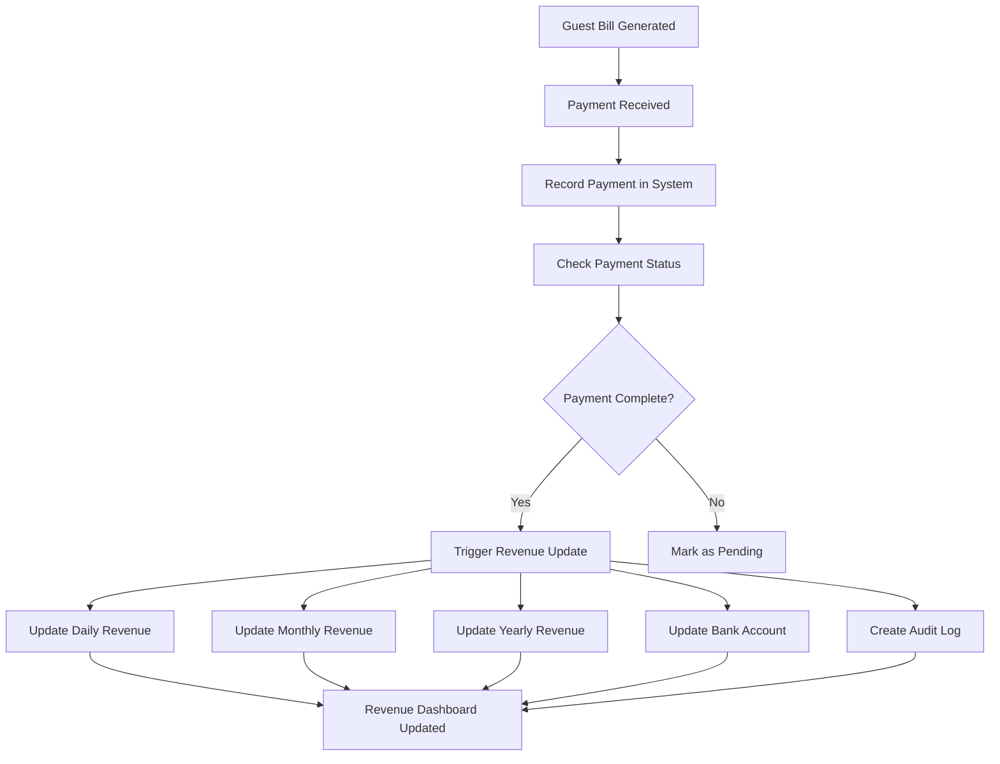

<<<<<<< HEAD
# 🏨 Automatic Revenue Tracking System

A comprehensive system that automatically adds revenue to the Hotel account whenever invoices are generated with 'paid' status, complete with proper credit labeling and detailed transaction tracking.

## 🚀 **FEATURES IMPLEMENTED**

### ✅ **Automatic Revenue Addition**
- **Real-time Processing**: Revenue is automatically added to the Hotel account when invoices are created with 'paid' status
- **Automatic Balance Updates**: Hotel account balance is updated in real-time
- **Transaction Creation**: Detailed credit transactions are created for audit trail
- **Revenue Breakdown**: Separate transactions for accommodation, extra charges, and taxes

### ✅ **Enhanced Credit Labeling**
- **Proper Credit Categories**: Revenue is categorized as 'accommodation_revenue' or 'other_services_revenue'
- **Detailed Descriptions**: Each transaction includes comprehensive description and notes
- **Reference Tracking**: Links transactions to specific bookings and invoices
- **Payment Method Tracking**: Records how revenue was received (cash, card, UPI, etc.)

### ✅ **Eye Icon for Credit Information**
- **Detailed Transaction View**: Click the eye icon to view comprehensive credit information
- **Revenue Breakdown**: See exactly how revenue was calculated and categorized
- **Audit Trail**: Complete transaction history with timestamps and user information
- **Export Functionality**: Export credit details for reporting purposes

## 🔧 **TECHNICAL IMPLEMENTATION**

### **1. Invoice Creation API Enhancement**
```typescript
// app/api/invoices/route.ts
// Automatically adds revenue to Hotel account when invoice is created with 'paid' status
if (body.status === 'paid') {
  await EnhancedAccountService.addRevenueToMainAccount(
    body.bookingId,
    body.totalAmount,
    revenueBreakdown,
    paymentMethod,
    processedBy,
    description
  );
}
```

### **2. Enhanced Account Service Method**
```typescript
// lib/enhanced-account-service.ts
static async addRevenueToMainAccount(
  bookingId: string,
  totalAmount: number,
  revenueBreakdown: {
    accommodation: number;
    extraCharges: number;
    taxes: number;
  },
  paymentMethod: string,
  processedBy: string,
  description: string
): Promise<void>
```

### **3. Transaction Creation**
- **Main Transaction**: Total revenue amount with comprehensive description
- **Breakdown Transactions**: Separate transactions for accommodation, extra charges, and taxes
- **Proper Categorization**: Uses predefined transaction categories for consistency
- **Audit Information**: Includes processed by, payment method, and reference details

## 📊 **USER INTERFACE ENHANCEMENTS**

### **Billing Table Updates**
- **Revenue Indicator**: Shows "Revenue added to Hotel account" for paid invoices
- **Summary Card**: Displays total revenue added to Hotel account
- **Notification Banner**: Informs users about automatic revenue tracking
- **Visual Feedback**: Green checkmarks and indicators for successful revenue addition

### **Account Management Updates**
- **Eye Icon**: Added to transaction table for viewing credit information
- **Credit Modal**: Comprehensive view of revenue transaction details
- **Revenue Breakdown**: Shows how revenue was calculated and categorized
- **Export Options**: Download credit information for reporting

## 🔄 **WORKFLOW**

### **1. Invoice Generation**
```
User generates invoice → Invoice created with 'paid' status → 
Revenue automatically added to Hotel account → Balance updated → 
Transaction records created → User sees confirmation
```

### **2. Revenue Tracking**
```
Revenue added → Hotel account balance increases → 
Credit transaction created → Eye icon available for details → 
User can view comprehensive credit information
```

### **3. Account Management**
```
User navigates to Account Management → Views transactions → 
Clicks eye icon → Sees detailed credit information → 
Can export details for reporting
```

## 📈 **BENEFITS**

### **For Hotel Management**
- **Real-time Financial Tracking**: Always know current Hotel account balance
- **Automated Revenue Recording**: No manual entry required
- **Complete Audit Trail**: Track every revenue transaction
- **Accurate Financial Reporting**: Reliable data for decision making

### **For Staff**
- **Simplified Workflow**: No need to manually record revenue
- **Clear Visibility**: Easy to see what revenue has been added
- **Detailed Information**: Access to comprehensive transaction details
- **Professional Interface**: Modern, intuitive design

### **For Accounting**
- **Accurate Records**: Every transaction is properly categorized
- **Compliance Ready**: Complete audit trail for regulatory requirements
- **Export Capability**: Easy data export for external accounting systems
- **Real-time Updates**: No delays in financial reporting

## 🛠️ **SETUP & CONFIGURATION**

### **Prerequisites**
- Enhanced Account Service must be properly configured
- Main Hotel account must exist in the system
- Proper transaction categories must be defined

### **Database Requirements**
- `bank_account` table with main account
- `transaction` table for recording credits
- Proper indexes for performance

### **API Endpoints**
- `POST /api/invoices` - Enhanced with automatic revenue tracking
- `GET /api/accounts` - For viewing account balances and transactions

## 🔍 **TROUBLESHOOTING**

### **Common Issues**
1. **Revenue Not Added**: Check if invoice status is 'paid'
2. **Transaction Not Visible**: Verify account management page is refreshed
3. **Balance Not Updated**: Check for database transaction errors

### **Debug Information**
- Console logs show successful revenue addition
- Error logs capture any failures in the process
- Transaction records provide complete audit trail

## 📱 **USER GUIDE**

### **For Front Desk Staff**
1. Generate invoice with 'paid' status
2. Revenue is automatically added to Hotel account
3. See confirmation message and visual indicators
4. No additional steps required

### **For Management**
1. Navigate to Account Management
2. View transaction history with eye icons
3. Click eye icon to see detailed credit information
4. Export data for external reporting

### **For Accounting Staff**
1. Access comprehensive transaction records
2. View revenue breakdown by category
3. Export data for external systems
4. Maintain complete audit trail

## 🔮 **FUTURE ENHANCEMENTS**

### **Planned Features**
- **Revenue Analytics Dashboard**: Visual representation of revenue trends
- **Automated Reporting**: Scheduled revenue reports
- **Integration**: Connect with external accounting systems
- **Advanced Categorization**: More detailed revenue breakdowns

### **Potential Improvements**
- **Real-time Notifications**: Alert management of significant revenue
- **Revenue Forecasting**: Predict future revenue based on trends
- **Multi-currency Support**: Handle different currencies
- **Advanced Export Formats**: PDF, Excel, and other formats

## 📞 **SUPPORT**

For technical support or questions about the automatic revenue tracking system:
- Check the console logs for detailed information
- Review transaction records in Account Management
- Verify invoice status and payment information
- Contact system administrator for complex issues

---

**Last Updated**: December 2024  
**Version**: 1.0.0  
**System**: Hotel Management System
=======
# 🚀 Automatic Revenue Tracking System

## 📋 Overview

The HMS (Hotel Management System) now features a comprehensive **Automatic Revenue Tracking System** that ensures every bill payment is automatically reflected in the revenue reports without manual intervention.

## ✨ Key Features

### 🔄 **Automatic Revenue Updates**
- **Real-time Tracking**: Revenue is automatically updated when bills are paid
- **Multi-period Updates**: Updates daily, monthly, and yearly revenue reports
- **Service Categorization**: Revenue is categorized by service type (accommodation, food & beverage, spa, etc.)
- **Payment Method Tracking**: Tracks revenue by payment method for financial reporting

### 📊 **Revenue Dashboard**
- **Real-time Status**: Shows revenue tracking status for each booking
- **Payment History**: Displays recent payments with details
- **Revenue Summary**: Overview of total revenue, bookings, and trends
- **Status Indicators**: Visual indicators for revenue tracking status

### 🔍 **Audit Trail**
- **Comprehensive Logging**: All revenue updates are logged for audit purposes
- **Error Tracking**: Failed revenue updates are logged with detailed error information
- **Status Monitoring**: Track revenue update status for each booking

## 🏗️ System Architecture

### **Core Components**

1. **RevenueHooks** (`lib/revenue-hooks.ts`)
   - Handles automatic revenue updates
   - Manages revenue reversals
   - Provides audit logging

2. **BillingService** (`lib/billing-service.ts`)
   - Triggers revenue updates on payment completion
   - Integrates with bank account system
   - Handles payment processing

3. **RevenueService** (`lib/revenue-service.ts`)
   - Generates comprehensive revenue reports
   - Calculates revenue by category
   - Manages revenue data

4. **Revenue Tracking Dashboard** (`components/dashboard/revenue-tracking-dashboard.tsx`)
   - Real-time revenue status monitoring
   - Payment history visualization
   - Revenue tracking information

## 🔄 **Automatic Workflow**

### **Payment Processing Flow**


### **Revenue Update Process**

1. **Payment Detection**: System detects when a payment is completed
2. **Status Check**: Verifies payment status is 'paid'
3. **Revenue Calculation**: Calculates revenue by service category
4. **Multi-period Update**: Updates daily, monthly, and yearly reports
5. **Bank Integration**: Updates bank account balances
6. **Audit Logging**: Creates comprehensive audit trail

## 📊 **Revenue Categories**

The system automatically categorizes revenue into:

- **Accommodation**: Room charges and stay fees
- **Food & Beverage**: Restaurant and room service charges
- **Spa Services**: Spa and wellness treatments
- **Transport**: Airport transfers and transportation
- **Laundry**: Laundry and dry cleaning services
- **Minibar**: In-room minibar charges
- **Conference**: Meeting room and conference services
- **Other**: Miscellaneous services and charges

## 🛠️ **Technical Implementation**

### **API Endpoints**

```typescript
// Revenue Status Check
GET /api/revenue/status?bookingId={id}
// Returns revenue tracking status for a booking

// Revenue Reports
GET /api/revenue/enhanced
// Returns comprehensive revenue reports

// Payment Processing
POST /api/payments
// Records payment and triggers revenue update
```

### **Database Schema**

```sql
-- Revenue Reports Table
model revenue_report {
  id                   String   @id @default(cuid())
  date                 DateTime
  period_type          String   // daily, monthly, yearly
  accommodation_revenue Float   @default(0)
  food_beverage_revenue Float   @default(0)
  spa_revenue          Float    @default(0)
  transport_revenue    Float    @default(0)
  laundry_revenue      Float    @default(0)
  minibar_revenue      Float    @default(0)
  other_revenue        Float    @default(0)
  total_revenue        Float    @default(0)
  // ... more fields
}
```

### **Revenue Hooks System**

```typescript
// Automatic revenue updates
RevenueHooks.onPaymentCompleted(bookingId, amount)
// Updates revenue when payment is completed

RevenueHooks.onPaymentReversed(bookingId, amount)
// Reverses revenue when payment is cancelled

RevenueHooks.onServicesAdded(bookingId, additionalAmount)
// Updates revenue for added services to paid bookings
```

## 🎯 **Usage Guide**

### **For Hotel Staff**

1. **Process Payments**: Use the billing management interface to record payments
2. **Monitor Revenue**: Check the revenue tracking dashboard for real-time updates
3. **View Reports**: Access detailed revenue reports in the revenue section
4. **Track Status**: Monitor revenue tracking status for each booking

### **For Administrators**

1. **Revenue Dashboard**: Access `/dashboard/revenue-tracking` for comprehensive monitoring
2. **Audit Logs**: Check console logs for detailed revenue update information
3. **Error Monitoring**: Monitor for any revenue update failures
4. **Report Generation**: Generate detailed revenue reports for analysis

## 🔍 **Monitoring & Troubleshooting**

### **Revenue Status Indicators**

- **🟢 Up to Date**: Revenue has been automatically tracked
- **🟡 Pending**: Payment pending, revenue not yet tracked
- **🔴 Error**: Issue with revenue tracking

### **Console Logging**

The system provides detailed console logging:

```bash
🔄 Starting revenue update for booking abc123 - Amount: 5000
📊 Updating revenue for John Doe - Total: 5000, Payment: 5000
📅 Updating daily revenue for Mon Jan 15 2024
📅 Updating monthly revenue for Mon Jan 15 2024
📅 Updating yearly revenue for Mon Jan 15 2024
✅ Revenue updated successfully for booking abc123
💰 Guest: John Doe, Amount: 5000, Date: 2024-01-15T10:30:00.000Z
📝 Revenue Log: payment_completed - Booking: abc123, Amount: 5000, Date: 2024-01-15T10:30:00.000Z
```

### **Error Handling**

- **Payment Processing**: If revenue update fails, payment is still recorded
- **Error Logging**: All errors are logged with detailed information
- **Retry Mechanism**: System can retry failed revenue updates
- **Manual Override**: Administrators can manually trigger revenue updates if needed

## 📈 **Benefits**

### **For Hotel Management**
- **Real-time Revenue Tracking**: Always know current revenue status
- **Automatic Updates**: No manual intervention required
- **Accurate Reporting**: Eliminates human error in revenue calculations
- **Audit Compliance**: Complete audit trail for financial compliance

### **For Staff**
- **Simplified Workflow**: Focus on guest service, not data entry
- **Immediate Feedback**: See revenue updates in real-time
- **Error Prevention**: Automatic validation prevents revenue tracking errors
- **Time Savings**: No manual revenue calculations required

### **For Financial Reporting**
- **Accurate Data**: Real-time, accurate revenue data
- **Categorized Reports**: Detailed breakdown by service type
- **Multi-period Analysis**: Daily, monthly, and yearly reports
- **Payment Method Analysis**: Track revenue by payment method

## 🔧 **Configuration**

### **Environment Variables**

```env
# Database configuration
DATABASE_URL="mysql://..."

# Revenue tracking settings
REVENUE_AUTO_UPDATE=true
REVENUE_LOG_LEVEL=info
```

### **Customization Options**

- **Revenue Categories**: Add or modify revenue categories
- **Update Frequency**: Configure how often revenue reports are updated
- **Logging Level**: Adjust the level of detail in revenue logs
- **Notification Settings**: Configure revenue update notifications

## 🚀 **Future Enhancements**

### **Planned Features**
- **Real-time Notifications**: Push notifications for revenue updates
- **Advanced Analytics**: Predictive revenue analysis
- **Integration APIs**: Connect with external accounting systems
- **Mobile Dashboard**: Revenue tracking on mobile devices
- **Automated Reports**: Scheduled revenue report generation

### **Performance Optimizations**
- **Caching**: Cache frequently accessed revenue data
- **Batch Processing**: Process multiple revenue updates efficiently
- **Background Jobs**: Handle revenue updates asynchronously
- **Database Optimization**: Optimize revenue report queries

## 📞 **Support**

For technical support or questions about the automatic revenue tracking system:

1. **Check Console Logs**: Look for detailed error messages
2. **Review Documentation**: Refer to this README and other system documentation
3. **Contact Development Team**: For complex issues or feature requests

---

**Note**: This automatic revenue tracking system ensures that every bill payment is accurately reflected in your revenue reports, providing real-time financial visibility and eliminating manual data entry errors.
>>>>>>> 2bfb5ac0ecad7768c2a0e781c04f1c79a6db8397
