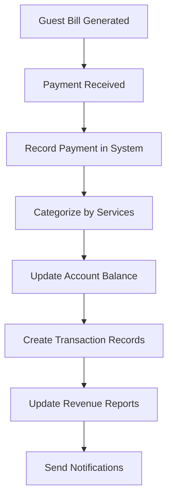

# 🏦 Complete Bank Account & Financial Management System

A comprehensive bank account system that automatically tracks all revenue and expenses in real-time. Every payment, refund, and expense is recorded with detailed transaction history for complete financial transparency.

## 🚀 **SYSTEM OVERVIEW**

### ✅ **Automatic Financial Tracking**
- **Real-time Updates**: Every bill payment automatically adds money to accounts
- **Category-wise Revenue**: Separate tracking for accommodation, F&B, spa, etc.
- **Expense Management**: Complete expense tracking with categories
- **Revenue Reversals**: Automatic reversal when payment status changes
- **Multi-Account Support**: Main, petty cash, online payments, savings accounts

### ✅ **Complete Integration**
- **Billing System Integration**: Payments automatically update bank accounts
- **Revenue Calculation**: Real-time balance updates
- **Transaction History**: Every financial movement is recorded
- **Audit Trail**: Complete transparency with who processed what when

## 📊 **DATABASE STRUCTURE**

### **Bank Account Table**
```sql
model bank_account {
  id              String        @id @default(cuid())
  accountName     String
  accountNumber   String?
  bankName        String?
  accountType     account_type  @default(main)
  balance         Float         @default(0)
  isActive        Boolean       @default(true)
  createdAt       DateTime      @default(now())
  updatedAt       DateTime      @updatedAt
  transactions    transaction[]
}
```

### **Transaction Table**
```sql
model transaction {
  id                String             @id @default(cuid())
  accountId         String
  type              transaction_type   // credit or debit
  category          transaction_category
  amount            Float
  description       String
  referenceId       String?            // booking/invoice/payment ID
  referenceType     reference_type?
  paymentMethod     payment_method?
  processedBy       String?
  notes             String?
  transactionDate   DateTime           @default(now())
  createdAt         DateTime           @default(now())
  updatedAt         DateTime           @updatedAt
  account           bank_account       @relation(fields: [accountId], references: [id])
}
```

### **Account Types**
- **main**: Primary hotel account for general operations
- **petty_cash**: Cash on hand for small expenses
- **online_payments**: Digital payment gateway funds
- **savings**: Long-term savings account
- **current**: Business current account

### **Transaction Categories**

#### **Revenue Categories** (Credits)
- `accommodation_revenue`: Room bookings and charges
- `food_beverage_revenue`: Restaurant and room service
- `spa_revenue`: Spa and wellness services
- `transport_revenue`: Airport transfers and tours
- `laundry_revenue`: Laundry and dry cleaning
- `minibar_revenue`: Minibar consumption
- `other_services_revenue`: Miscellaneous services

#### **Expense Categories** (Debits)
- `room_maintenance`: Room repairs and upkeep
- `staff_salary`: Employee salaries and wages
- `utilities`: Electricity, water, internet bills
- `marketing`: Advertising and promotional costs
- `supplies`: Inventory and consumables
- `equipment`: Furniture and equipment purchases
- `taxes_paid`: Government taxes and fees
- `bank_charges`: Banking and transaction fees
- `refunds`: Guest refunds and reversals
- `discounts`: Promotional discounts given
- `other_expense`: Miscellaneous expenses

## 🔄 **AUTOMATIC WORKFLOW**

### **Payment Processing Flow**


### **Revenue Categorization**
When a payment is received, the system automatically:

1. **Calculates Service Breakdown**:
   ```javascript
   const serviceBreakdown = {
     accommodation: roomCharges,
     foodBeverage: restaurantCharges,
     spa: spaCharges,
     transport: transferCharges,
     laundry: laundryCharges,
     minibar: minibarCharges,
     other: miscellaneousCharges
   };
   ```

2. **Creates Individual Transactions**:
   - Each service category gets its own transaction record
   - Proper categorization for accurate reporting
   - Reference to original booking for audit trail

3. **Updates Account Balance**:
   - Real-time balance calculation
   - Immediate availability of funds
   - Prevents overdrafts and negative balances

### **Revenue Reversal Process**
When payment status changes from "paid" to "pending":

1. **Automatic Detection**: System detects status change
2. **Calculate Reversal**: Determines exact amounts to reverse
3. **Create Reversal Transactions**: Debit entries with "refund" category
4. **Update Balances**: Adjust account balances accordingly
5. **Maintain Audit Trail**: Keep complete record of all changes

## 💼 **ACCOUNT MANAGEMENT DASHBOARD**

### **Account Overview**
- **Balance Cards**: Real-time account balances
- **Transaction Summary**: Credits, debits, and net income
- **Period Filtering**: Daily, weekly, monthly, yearly views
- **Account Filtering**: View specific account or all accounts

### **Transaction Management**
- **Recent Transactions**: Complete transaction history
- **Transaction Details**: Amount, category, description, processed by
- **Search & Filter**: Find specific transactions quickly
- **Export Options**: Download transaction reports

### **Revenue Analytics**
- **Category Breakdown**: Visual representation of revenue sources
- **Percentage Analysis**: See which services generate most revenue
- **Trend Analysis**: Track performance over time
- **Comparison Tools**: Compare different periods

### **Expense Management**
- **Add Expenses**: Quick expense entry form
- **Category Selection**: Predefined expense categories
- **Payment Method**: Track how expenses were paid
- **Approval Workflow**: Staff authorization tracking

### **Account Transfers**
- **Inter-Account Transfers**: Move money between accounts
- **Transfer History**: Complete audit trail
- **Balance Validation**: Prevent insufficient fund transfers
- **Reference Notes**: Document transfer purposes

## 🛠️ **TECHNICAL IMPLEMENTATION**

### **AccountService Class**
```typescript
export class AccountService {
  // Core Methods
  static async createAccount(name, type, number?, bank?, balance?)
  static async addTransaction(accountId, transactionData)
  static async processPaymentRevenue(bookingId, amount, breakdown, method, staff)
  static async reversePaymentRevenue(bookingId, amount, breakdown, staff)
  static async addExpense(category, amount, description, staff, method?, notes?)
  
  // Query Methods
  static async getAllAccountBalances()
  static async getTransactionSummary(startDate, endDate, accountId?)
  static async getRevenueBreakdown(startDate, endDate, accountId?)
  static async getRecentTransactions(limit, accountId?)
  static async getDailyCashFlow(days)
  
  // Transfer Methods
  static async transferBetweenAccounts(fromId, toId, amount, description, staff)
}
```

### **Integration with Billing System**
```typescript
// In BillingService.processPayment()
if (paymentStatus === 'paid') {
  await RevenueHooks.onPaymentCompleted(bookingId, amount);
  
  // Add to bank account system
  await this.processPaymentToAccount(bookingId, amount, paymentMethod, receivedBy);
}
```

### **API Endpoints**
```typescript
// Account Management
GET  /api/accounts?action=balances          // Get all account balances
GET  /api/accounts?action=summary           // Get transaction summary
GET  /api/accounts?action=breakdown         // Get revenue breakdown
GET  /api/accounts?action=transactions      // Get transaction history
POST /api/accounts                          // Create account, add expense, transfer

// Revenue Reversal
POST /api/accounts/reverse-payment          // Reverse payment from accounts
```

## 📈 **REAL-TIME FINANCIAL TRACKING**

### **Live Balance Updates**
- **Instant Updates**: Balances update immediately on payment
- **Multiple Currency Support**: Handle different payment methods
- **Decimal Precision**: Accurate to the paisa for Indian currency
- **Negative Balance Protection**: Prevent overdrafts on savings accounts

### **Comprehensive Reporting**
```typescript
interface TransactionSummary {
  totalCredits: number;      // Total money received
  totalDebits: number;       // Total money spent
  netAmount: number;         // Profit/Loss
  transactionCount: number;  // Total transactions
  creditCount: number;       // Number of revenue transactions
  debitCount: number;        // Number of expense transactions
}
```

### **Category Performance Analysis**
```typescript
interface CategoryBreakdown {
  category: string;          // Revenue/Expense category
  totalAmount: number;       // Total amount in category
  transactionCount: number;  // Number of transactions
  percentage: number;        // Percentage of total revenue/expenses
}
```

## 🎯 **BUSINESS BENEFITS**

### **Financial Transparency**
- **Complete Audit Trail**: Every rupee tracked from source to destination
- **Staff Accountability**: Know who processed every transaction
- **Real-time Visibility**: Current financial position always available
- **Historical Analysis**: Track performance trends over time

### **Operational Efficiency**
- **Automated Bookkeeping**: No manual entry of payment data
- **Instant Reconciliation**: Payments automatically categorized
- **Error Reduction**: Automated calculations prevent mistakes
- **Time Savings**: Eliminates manual financial data entry

### **Strategic Insights**
- **Revenue Source Analysis**: Know which services are most profitable
- **Expense Pattern Recognition**: Identify cost optimization opportunities
- **Cash Flow Management**: Predict and manage cash requirements
- **Growth Tracking**: Monitor business expansion metrics

## 🔒 **SECURITY & COMPLIANCE**

### **Data Security**
- **Encrypted Transactions**: All financial data encrypted
- **Access Control**: Role-based access to financial information
- **Audit Logging**: Complete log of who accessed what when
- **Backup & Recovery**: Automated backup of financial records

### **Compliance Features**
- **GST Integration**: Tax calculations built into transactions
- **Financial Reporting**: Generate reports for tax compliance
- **Bank Reconciliation**: Match system records with bank statements
- **Regulatory Compliance**: Meets accounting standards

## 🚀 **SETUP & USAGE**

### **Initial Setup**
1. **Database Migration**: Run Prisma migration to create tables
2. **Account Creation**: Setup script creates initial accounts
3. **Sample Data**: Demo transactions for testing
4. **Dashboard Access**: Available at `/dashboard/billing` → Account Management tab

### **Daily Operations**
1. **Bill Generation**: Payments automatically update accounts
2. **Expense Entry**: Add expenses through dashboard
3. **Account Monitoring**: Check balances and transactions
4. **Report Generation**: Download financial reports as needed

### **Account Types Setup**
```javascript
// Automatically created accounts:
{
  "Main Hotel Account": { type: "main", balance: 0 },
  "Petty Cash": { type: "petty_cash", balance: 5000 },
  "Online Payments Account": { type: "online_payments", balance: 0 },
  "Hotel Savings Account": { type: "savings", balance: 0 }
}
```

## 📊 **SAMPLE REPORTS**

### **Daily Summary**
- Opening Balance: ₹50,000
- Revenue Received: ₹15,000
- Expenses Paid: ₹3,000
- Closing Balance: ₹62,000
- Net Income: ₹12,000

### **Revenue Breakdown**
- Accommodation: ₹10,000 (66.7%)
- Food & Beverage: ₹3,000 (20.0%)
- Spa Services: ₹1,500 (10.0%)
- Transport: ₹500 (3.3%)

### **Top Expenses**
- Staff Salary: ₹15,000
- Utilities: ₹2,500
- Supplies: ₹3,200
- Marketing: ₹5,000

## 🎉 **READY FOR PRODUCTION**

The bank account system is now **fully operational** with:

✅ **Real-time financial tracking**
✅ **Automatic payment processing**
✅ **Complete expense management**
✅ **Revenue categorization**
✅ **Account balance monitoring**
✅ **Transaction history**
✅ **Financial reporting**
✅ **Audit trail maintenance**

### **Next Steps**
1. **Test Payment Processing**: Generate a bill and see automatic account updates
2. **Add Expenses**: Use the expense management feature
3. **View Reports**: Check the account dashboard analytics
4. **Monitor Cash Flow**: Track daily financial movements

Your hotel now has **enterprise-grade financial management** with complete transparency and real-time tracking! 🏨💰

---

*Professional bank account system with automatic revenue and expense tracking.*

