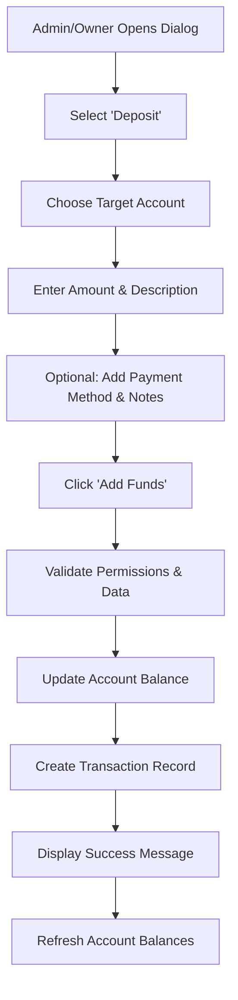
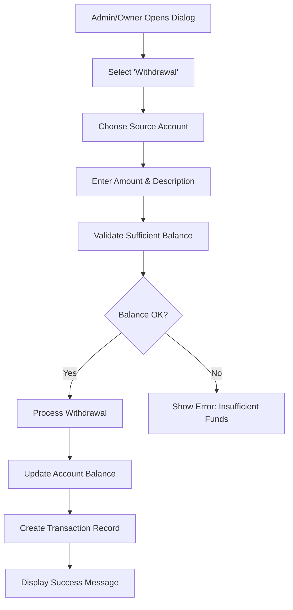

# 🧹 Clean Setup & Manual Deposit System

## 🎯 **IMPLEMENTATION COMPLETED**

### ✅ **Dummy Data Cleanup**
- **Removed**: All sample/demo transactions from the system
- **Reset**: All account balances to ₹0.00 
- **Status**: System is now ready for real transactions

### ✅ **Manual Deposit/Withdrawal System**
- **Admin/Owner Only**: Role-based permissions for manual transactions
- **Full Functionality**: Add or remove funds from any account
- **Complete Audit Trail**: All manual transactions are tracked
- **Payment Method Tracking**: Optional payment method recording

## 🚀 **NEW FEATURES**

### **1. Clean Account System**
```
📊 Current Account Status:
   • Main Hotel Account: ₹0.00 (0 transactions)
   • All User Accounts: ₹0.00 (0 transactions)
   • System Ready: For real transactions
```

### **2. Manual Deposit/Withdrawal Interface**
**Location**: `/dashboard/accounts` → "Add/Remove Funds" button

**Features**:
- **Transaction Types**:
  - 💚 **Deposit**: Add money to any account
  - 🔴 **Withdrawal**: Remove money from any account
- **Account Selection**: Choose from all available accounts
- **Amount Input**: Precise amount entry with validation
- **Description**: Required description for audit purposes
- **Payment Method**: Optional tracking (Cash, Card, UPI, etc.)
- **Notes**: Additional notes for record keeping

### **3. Role-Based Access Control**
- **OWNER/ADMIN**: Can perform manual deposits/withdrawals
- **RECEPTION**: Cannot access manual transaction features
- **Validation**: System prevents unauthorized access

### **4. Enhanced API Endpoints**
```typescript
POST /api/accounts/manual-transaction
Body: {
  accountId: string,
  amount: number,
  type: 'deposit' | 'withdrawal',
  description: string,
  notes?: string,
  paymentMethod?: string
}
```

## 🔄 **TRANSACTION FLOW**

### **Manual Deposit Process**


### **Manual Withdrawal Process**


## 🎮 **HOW TO USE**

### **For Admin/Owner Users:**

1. **Access Manual Transactions**:
   - Go to `/dashboard/accounts`
   - Click "Add/Remove Funds" button

2. **Add Money to Account**:
   - Select "Deposit (Add Money)"
   - Choose target account
   - Enter amount and description
   - Optionally add payment method and notes
   - Click "Add Funds"

3. **Remove Money from Account**:
   - Select "Withdrawal (Remove Money)"
   - Choose source account
   - Enter amount and description
   - System validates sufficient balance
   - Click "Remove Funds"

### **Real Transaction Examples**:

**Example 1: Initial Cash Setup**
- Type: Deposit
- Account: Main Hotel Account
- Amount: ₹50,000
- Description: "Initial cash deposit for operations"
- Payment Method: Cash

**Example 2: User Account Funding**
- Type: Deposit
- Account: John's Account
- Amount: ₹10,000
- Description: "Initial account funding for regular customer"
- Payment Method: Bank Transfer

**Example 3: Expense Payment**
- Type: Withdrawal
- Account: Main Hotel Account
- Amount: ₹5,000
- Description: "Petty cash withdrawal for daily expenses"
- Payment Method: Cash

## 📊 **AUTOMATIC TRANSACTION TRACKING**

### **Real Revenue Tracking**
When actual bookings and payments occur:
- ✅ **Guest Payments**: Automatically added to accounts
- ✅ **User Allocation**: Revenue goes to guest account (if registered user)
- ✅ **Main Account**: Revenue always goes to main hotel account
- ✅ **Service Breakdown**: Detailed categorization by service type

### **Real Expense Tracking**
When actual expenses are made:
- ✅ **Role-Based**: Reception from own account, Admin from any account
- ✅ **Balance Validation**: Prevents overspending
- ✅ **Dual Deduction**: Both user and main account updated
- ✅ **Expense Categories**: 15 predefined expense types

## 🔒 **SECURITY & VALIDATION**

### **Permission Controls**
- ✅ **API Level**: Server-side role validation
- ✅ **UI Level**: Buttons hidden for unauthorized users
- ✅ **Database Level**: Transaction validation

### **Data Validation**
- ✅ **Amount Validation**: Must be greater than 0
- ✅ **Balance Checks**: Withdrawal validation
- ✅ **Required Fields**: Description and account mandatory
- ✅ **User Authentication**: Session-based security

### **Audit Trail**
- ✅ **Who**: User ID of person performing transaction
- ✅ **When**: Timestamp of transaction
- ✅ **What**: Full transaction details
- ✅ **Why**: Description and notes
- ✅ **How**: Payment method tracking

## 📈 **BUSINESS READY FEATURES**

### **Real-World Scenarios**
1. **Hotel Opening**: Add initial cash to main account
2. **VIP Customer**: Add credit to frequent guest account
3. **Emergency Expense**: Quick withdrawal for urgent needs
4. **Account Corrections**: Fix any balance discrepancies
5. **End of Day**: Cash deposit from daily operations

### **Professional Operations**
- 💼 **Cash Management**: Track cash deposits and withdrawals
- 📋 **Accounting Compliance**: Full audit trail for accountants
- 🏨 **Hotel Operations**: Seamless integration with daily operations
- 👥 **Staff Management**: Role-based access control
- 📊 **Financial Reporting**: Real-time balance tracking

## 🎉 **SYSTEM STATUS**

### **✅ COMPLETED FEATURES**
- ✅ **Clean Database**: All dummy data removed
- ✅ **Zero Balances**: All accounts start fresh
- ✅ **Manual Deposits**: Full deposit functionality
- ✅ **Manual Withdrawals**: Full withdrawal functionality
- ✅ **Role Permissions**: Admin/Owner only access
- ✅ **API Endpoints**: Complete backend support
- ✅ **UI Interface**: Professional dashboard integration
- ✅ **Validation**: Complete data and business rule validation
- ✅ **Audit Trail**: Full transaction history

### **🚀 READY FOR PRODUCTION**
Your hotel management system now has:
- **Clean Financial System**: Starting fresh with ₹0 balances
- **Manual Fund Management**: Add/remove money as needed
- **Real Transaction Tracking**: Automatic updates from bookings
- **Professional Controls**: Role-based access and validation
- **Complete Audit Trail**: Every transaction tracked and recorded

## 💡 **NEXT STEPS**

1. **Start Using**: System is ready for real transactions
2. **Add Initial Funds**: Use manual deposit for starting cash
3. **Process Bookings**: Watch automatic revenue allocation
4. **Track Expenses**: Use expense management features
5. **Monitor Balances**: View real-time account status

Your hotel now has **enterprise-grade financial management** with clean setup and manual fund control! 🏨💰

---

*Professional financial system with clean setup and manual transaction capabilities.*


