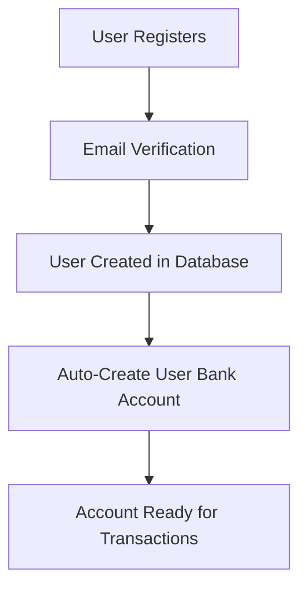
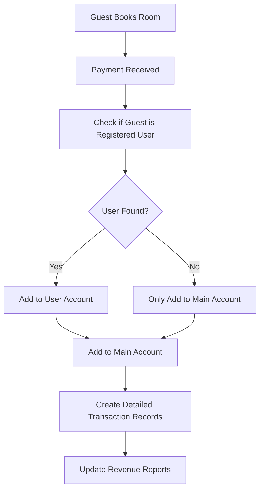
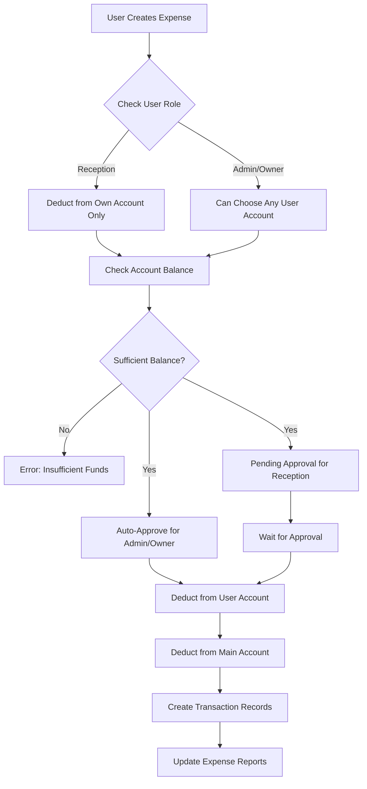
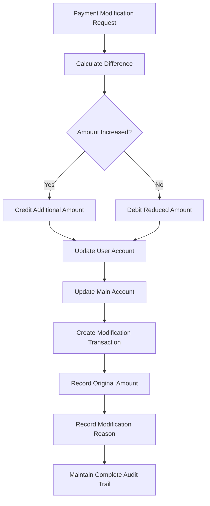

# 🏨 Enhanced Revenue & Expense Management System

A comprehensive financial management system for hotel operations featuring user-specific bank accounts, automated revenue allocation, expense management with role-based permissions, and complete audit trails.

## 🚀 **SYSTEM OVERVIEW**

### ✅ **Complete Financial Ecosystem**
- **User-Specific Bank Accounts**: Each user gets their own account automatically
- **Main Hotel Account**: Central account for all hotel operations
- **Automated Revenue Allocation**: Revenue goes to both user and main accounts
- **Role-Based Expense Management**: Permissions based on user roles
- **Payment Modification Tracking**: Complete audit trail for all changes
- **Real-Time Financial Tracking**: Live balance updates across all accounts

### ✅ **Advanced Features**
- **Expense Types Management**: Fully configurable expense categories
- **Multi-Account Transfers**: Transfer funds between any accounts
- **Payment Modification History**: Track all payment changes with reasons
- **Role-Based Access Control**: Different permissions for different user roles
- **Comprehensive Dashboard**: Separate modules for Revenue, Expenses, and Accounts

## 📊 **ENHANCED DATABASE STRUCTURE**

### **User-Specific Bank Accounts**
```sql
model bank_account {
  id              String        @id @default(cuid())
  accountName     String
  accountNumber   String?
  bankName        String?
  accountType     account_type  @default(main)
  balance         Float         @default(0)
  isActive        Boolean       @default(true)
  userId          String?       // Links to specific user
  isMainAccount   Boolean       @default(false) // Main hotel account
  createdAt       DateTime      @default(now())
  updatedAt       DateTime      @updatedAt
  transactions    transaction[]
  user            user?         @relation(fields: [userId], references: [id])
}
```

### **Expense Type Management**
```sql
model expense_type {
  id          String    @id @default(cuid())
  name        String    @unique
  description String?   @db.Text
  isActive    Boolean   @default(true)
  createdAt   DateTime  @default(now())
  updatedAt   DateTime  @updatedAt
  createdBy   String?   // User who created this expense type
  expenses    expense[]
}
```

### **Enhanced Expense Tracking**
```sql
model expense {
  id               String             @id @default(cuid())
  expenseTypeId    String
  amount           Float
  description      String
  notes            String?            @db.Text
  paymentMethod    payment_method?
  userId           String             // User who made the expense
  approvedBy       String?            // For approval workflow
  isApproved       Boolean            @default(false)
  expenseDate      DateTime           @default(now())
  referenceNumber  String?            // Receipt/bill reference
  createdAt        DateTime           @default(now())
  updatedAt        DateTime           @updatedAt
  expenseType      expense_type       @relation(fields: [expenseTypeId], references: [id])
  user             user               @relation(fields: [userId], references: [id])
  transactions     transaction[]      // Related bank account transactions
}
```

### **Advanced Transaction Tracking**
```sql
model transaction {
  id                String             @id @default(cuid())
  accountId         String
  type              transaction_type
  category          transaction_category
  amount            Float
  description       String
  referenceId       String?            // Reference to booking/invoice/payment/expense ID
  referenceType     reference_type?    // booking, invoice, payment, expense, etc.
  paymentMethod     payment_method?
  processedBy       String?
  notes             String?            @db.Text
  transactionDate   DateTime           @default(now())
  createdAt         DateTime           @default(now())
  updatedAt         DateTime           @updatedAt
  isModification    Boolean            @default(false) // For tracking payment modifications
  originalAmount    Float?             // Original amount before modification
  modificationReason String?           @db.Text
  account           bank_account       @relation(fields: [accountId], references: [id])
  expense           expense?           @relation(fields: [referenceId], references: [id])
}
```

## 🔄 **ENHANCED WORKFLOWS**

### **1. User Registration & Account Creation**


**Automatic Process:**
- When a user registers, a bank account is automatically created
- Account name: "{User Name}'s Account"
- Initial balance: ₹0
- Account type: current
- Linked to user ID

### **2. Enhanced Revenue Processing**


**Revenue Allocation Logic:**
1. **Guest Payment Received**: System checks if guest email matches registered user
2. **User Account Credit**: If registered user, add full amount to their account
3. **Main Account Credit**: Always add amount to main hotel account
4. **Service Breakdown**: Create separate transactions for each service category
5. **Audit Trail**: Complete record with booking reference and staff details

### **3. Advanced Expense Management**


**Role-Based Permissions:**
- **RECEPTION**: Can only expense from their own account
- **ADMIN**: Can expense from any user account
- **OWNER**: Can expense from any user account
- **Auto-Approval**: Admin and Owner expenses are auto-approved

### **4. Payment Modification System**


**Modification Features:**
- **Complete History**: All modifications tracked with original amounts
- **Audit Trail**: Who modified, when, and why
- **Reference Preservation**: Maintain link to original booking
- **Balance Accuracy**: Real-time balance adjustments

## 💼 **DASHBOARD MODULES**

### **1. Revenue Management Dashboard** (`/dashboard/revenue`)

**Features:**
- **Real-Time Revenue Tracking**: Live revenue updates across all categories
- **User Account Balances**: View all user accounts and their balances
- **Revenue Breakdown**: Accommodation, F&B, Spa, Transport, etc.
- **Payment Method Analysis**: Cash, Card, UPI, Bank Transfer, etc.
- **Booking Source Tracking**: Website, OTA, Phone, Walk-in, etc.
- **Date Range Filtering**: Flexible date range selection
- **Account Filtering**: Filter by specific user accounts

**Key Metrics Cards:**
- Total Revenue
- Accommodation Revenue
- F&B Revenue
- Other Services Revenue

### **2. Expense Management Dashboard** (`/dashboard/expenses`)

**Features:**
- **Role-Based Interface**: Different views for different user roles
- **Expense Type Management**: Full CRUD operations for Admin/Owner
- **Expense Creation**: Quick expense entry with validation
- **Account Selection**: Admin/Owner can choose which account to deduct from
- **Approval Workflow**: Pending expenses for Reception users
- **Expense History**: Complete expense tracking with filters
- **Payment Method Tracking**: Track how expenses were paid

**Default Expense Types:**
- Light Bill, Gas, Wi-Fi, TV
- Electric Maintenance, Water Bill
- Staff Salary, Cleaning Supplies
- Laundry Supplies, Kitchen Supplies
- Marketing, Insurance, Equipment Maintenance
- Security, Telephone

### **3. Account Management Dashboard** (`/dashboard/accounts`)

**Features:**
- **Account Balances Overview**: All accounts at a glance
- **Fund Transfers**: Transfer money between accounts
- **Transaction History**: Complete transaction tracking
- **Account Filtering**: Filter transactions by account, type, category
- **Financial Summary**: Total balances, main account, user accounts
- **Real-Time Updates**: Live balance updates

**Summary Cards:**
- Total Balance (All Accounts)
- Main Account Balance
- User Accounts Combined Balance
- Active Accounts Count

## 🔧 **TECHNICAL IMPLEMENTATION**

### **Enhanced Account Service** (`lib/enhanced-account-service.ts`)

```typescript
export class EnhancedAccountService {
  // User account management
  static async createUserAccount(userId, userName, initialBalance?)
  static async getUserAccountBalance(userId)
  static async getAllUserAccounts()
  
  // Revenue processing
  static async processPaymentRevenue(bookingId, amount, breakdown, method, staff, guestUserId?)
  static async processPaymentModification(bookingId, originalAmount, newAmount, reason, staff, guestUserId?)
  
  // Account operations
  static async transferBetweenAccounts(fromId, toId, amount, description, staff)
  static async getTransactionHistory(accountId?, userId?, startDate?, endDate?, limit?)
  
  // System management
  static async getOrCreateMainAccount()
  static async addTransaction(accountId, transactionData)
}
```

### **Expense Management APIs**

```typescript
// Expense Types Management
GET  /api/expense-types              // Get all expense types
POST /api/expense-types              // Create new expense type
PUT  /api/expense-types              // Update expense type
DELETE /api/expense-types?id=xyz     // Delete/deactivate expense type

// Expense Management
GET  /api/expenses                   // Get expenses with filters
POST /api/expenses                   // Create new expense

// Account Management
GET  /api/accounts/user-accounts     // Get all user accounts
GET  /api/accounts/transactions      // Get transaction history
POST /api/accounts/transfer          // Transfer between accounts
```

### **Enhanced Billing Integration**

The system automatically integrates with the existing billing system:

```typescript
// In BillingService.processPayment()
if (paymentStatus === 'paid') {
  // Enhanced revenue processing with user account allocation
  await EnhancedAccountService.processPaymentRevenue(
    bookingId,
    totalAmount,
    serviceBreakdown,
    paymentMethod,
    receivedBy,
    guestUserId // Automatically detected from guest email
  );
}
```

## 🎯 **BUSINESS BENEFITS**

### **Financial Transparency**
- **Complete User Tracking**: Know exactly which users generated how much revenue
- **Detailed Expense Tracking**: Every expense categorized and tracked
- **Real-Time Balances**: Always know current financial position
- **Audit Trail**: Complete history of all financial movements

### **Operational Efficiency**
- **Automated Processes**: Revenue allocation happens automatically
- **Role-Based Management**: Users can only do what they're authorized for
- **Streamlined Workflows**: Intuitive interfaces for all financial operations
- **Integrated System**: Works seamlessly with existing booking and billing

### **Advanced Reporting**
- **User Performance**: Track revenue generated by different users
- **Expense Analysis**: Understand spending patterns by category
- **Cash Flow Management**: Real-time view of money movement
- **Business Intelligence**: Make informed decisions with complete data

## 🔒 **SECURITY & COMPLIANCE**

### **Role-Based Access Control**
- **OWNER**: Full access to all features and accounts
- **ADMIN**: Manage expenses from any account, view all data
- **RECEPTION**: Limited to own account for expenses, view own data

### **Data Integrity**
- **Atomic Transactions**: All financial operations are atomic
- **Audit Logging**: Every change is logged with user and timestamp
- **Balance Validation**: Prevent negative balances and insufficient funds
- **Reference Tracking**: Every transaction linked to source booking/expense

### **Financial Controls**
- **Approval Workflows**: Expense approval for certain user roles
- **Modification Tracking**: Complete history of payment changes
- **Dual Account Updates**: Both user and main accounts updated simultaneously
- **Error Prevention**: Validation at every step to prevent financial errors

## 🚀 **SETUP & USAGE**

### **Installation**
1. **Database Migration**: Schema automatically updated with `npma prisma db push`
2. **Default Data**: Run `node scripts/setup-expense-types.js`
3. **User Accounts**: Created automatically on user registration
4. **Main Account**: Created automatically during setup

### **Daily Operations**

**For Reception Staff:**
- Create expenses from their own account
- View their own transaction history
- Track their account balance

**For Admin/Management:**
- Create expenses from any user account
- Manage expense types (add, edit, delete)
- Transfer funds between accounts
- View all financial data and reports
- Approve pending expenses

**For Owners:**
- Full access to all financial features
- Complete system oversight
- Strategic financial analysis
- Business performance tracking

### **Navigation**
- **Revenue**: `/dashboard/revenue` - Revenue tracking and analysis
- **Expenses**: `/dashboard/expenses` - Expense management and types
- **Accounts**: `/dashboard/accounts` - Account balances and transfers

## 📊 **SAMPLE SCENARIOS**

### **Scenario 1: Guest Booking with User Account**
1. **Guest Books**: John Doe (john@email.com) books a room for ₹5,000
2. **Payment Received**: Staff processes payment
3. **System Check**: Finds john@email.com is a registered user
4. **Revenue Allocation**:
   - ₹5,000 added to John's user account
   - ₹5,000 added to Main Hotel Account
   - Transaction records created for both

### **Scenario 2: Staff Expense**
1. **Reception Staff**: Creates ₹500 Wi-Fi bill expense
2. **Account Check**: System verifies staff has ₹500 in their account
3. **Expense Processing**:
   - ₹500 deducted from staff's account
   - ₹500 deducted from Main Hotel Account
   - Expense marked as "Pending Approval"
4. **Admin Approval**: Admin approves the expense
5. **Final Status**: Expense marked as "Approved"

### **Scenario 3: Payment Modification**
1. **Original Payment**: ₹1,000 for booking #123
2. **Modification Request**: Amount changed to ₹800 due to cancellation
3. **System Processing**:
   - ₹200 deducted from user account
   - ₹200 deducted from Main Hotel Account
   - Modification transaction created with reason
   - Original ₹1,000 transaction preserved
   - New ₹200 debit transaction added

## 🎉 **PRODUCTION READY**

The Enhanced Financial System is **fully operational** with:

✅ **User-specific bank accounts with automatic creation**
✅ **Comprehensive expense management with role-based permissions**
✅ **Advanced payment modification tracking**
✅ **Real-time revenue allocation across accounts**
✅ **Complete audit trails for all financial operations**
✅ **Professional dashboard interfaces**
✅ **Secure role-based access control**
✅ **Seamless integration with existing billing system**

### **What's New**
- 🏦 **User Bank Accounts**: Every user gets their own account automatically
- 💳 **Enhanced Expense System**: Full CRUD expense types with role-based management
- 📊 **Advanced Dashboards**: Separate modules for Revenue, Expenses, and Accounts
- 🔄 **Payment Modifications**: Complete audit trail for payment changes
- 👥 **Role-Based Permissions**: Different access levels for different user roles
- 💰 **Dual Account Updates**: Revenue goes to both user and main accounts
- 📈 **Real-Time Analytics**: Live financial tracking and reporting

Your hotel now has **enterprise-grade financial management** with complete user accountability, real-time tracking, and comprehensive audit trails! 🏨💰

---

*Professional financial management system with user-specific accounts and advanced expense tracking.*


