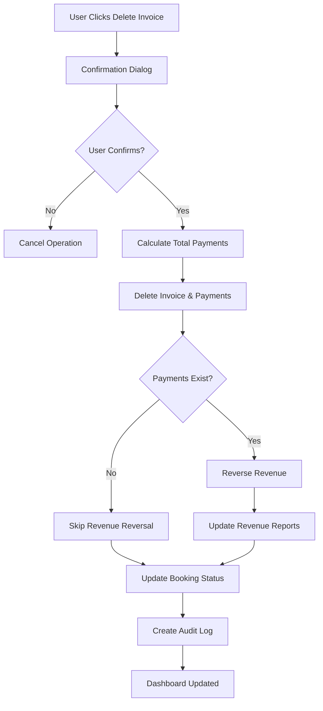
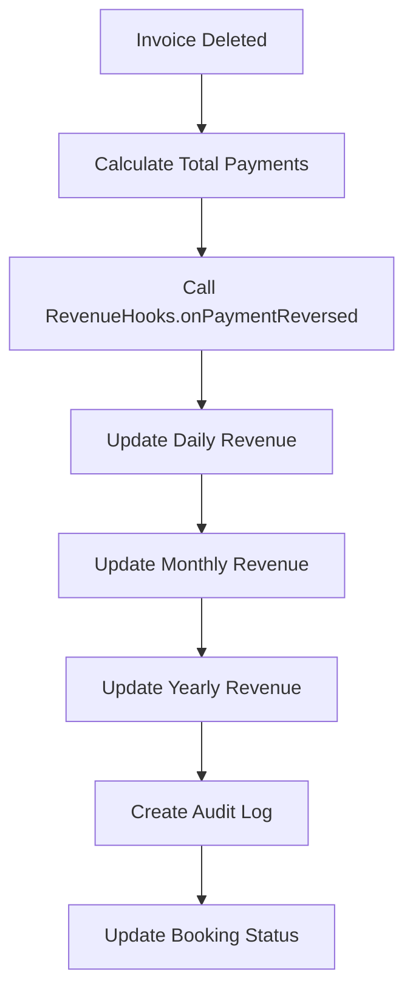

# 🗑️ Invoice Deletion & Revenue Reversal System

## 📋 Overview

The HMS (Hotel Management System) now includes comprehensive **Invoice Deletion & Revenue Reversal capabilities** that ensure when invoices are deleted, all associated revenue is automatically removed from the revenue tracking system, maintaining data integrity and financial accuracy.

## ✨ Key Features

### 🗑️ **Invoice Deletion**
- **Safe Deletion**: Delete invoices with comprehensive confirmation
- **Payment Cleanup**: Automatically delete all associated payments
- **Revenue Reversal**: Automatically reverse revenue when invoices are deleted
- **Status Updates**: Update booking payment status after deletion
- **Audit Trail**: Complete audit trail for all deletions

### 💰 **Automatic Revenue Reversal**
- **Immediate Reversal**: Revenue is reversed as soon as invoice is deleted
- **Payment Calculation**: Calculates total payments for the invoice
- **Revenue Reports Update**: Updates daily, monthly, and yearly revenue reports
- **Audit Logging**: Complete audit trail for revenue reversals

### 📊 **Enhanced Billing Management**
- **Delete Buttons**: Direct access to delete invoices from billing dashboard
- **Confirmation Dialogs**: Safe deletion with comprehensive warnings
- **Real-time Updates**: See changes immediately in the dashboard
- **Status Indicators**: Visual indicators for deletion status

## 🏗️ System Architecture

### **Core Components**

1. **Enhanced Invoice API** (`app/api/invoices/[id]/route.ts`)
   - DELETE endpoint with revenue reversal
   - Payment cleanup and status updates
   - Audit logging

2. **Revenue Hooks** (`lib/revenue-hooks.ts`)
   - Revenue reversal functionality
   - Multi-period revenue updates
   - Audit trail creation

3. **Billing Management UI** (`components/dashboard/billing-management.tsx`)
   - Delete invoice buttons
   - Confirmation dialogs
   - Real-time status updates

## 🔄 **Workflow**

### **Invoice Deletion Process**


### **Revenue Reversal Process**


## 🛠️ **Technical Implementation**

### **API Endpoints**

```typescript
// Delete Invoice with Revenue Reversal
DELETE /api/invoices/[id]
{
  "reason": "Invoice cancellation",
  "processedBy": "Admin"
}

// Response
{
  "success": true,
  "message": "Invoice deleted successfully",
  "reversedAmount": 5000,
  "newPaymentStatus": "pending"
}
```

### **Revenue Reversal Logic**

```typescript
// Calculate total payments for the invoice
const totalPayments = invoice.payments.reduce((sum, payment) => sum + payment.amount, 0);

// If there were payments, reverse the revenue
if (totalPayments > 0) {
  console.log(`💰 Reversing revenue for deleted invoice: ${totalPayments} for booking ${booking.id}`);
  await RevenueHooks.onPaymentReversed(booking.id, totalPayments);
}
```

### **Audit Trail**

```typescript
// Create audit log for invoice deletion
await prisma.transaction.create({
  data: {
    type: 'debit',
    category: 'refunds',
    amount: totalPayments,
    description: `Invoice deletion: ${reason}`,
    referenceId: booking.id,
    referenceType: 'booking',
    processedBy: processedBy || session.user?.name || 'System',
    notes: `Deleted invoice of ${invoiceAmount} with ${totalPayments} in payments for booking ${booking.id}. Reason: ${reason}`,
    isModification: true,
    originalAmount: totalPayments,
    modificationReason: reason,
  },
});
```

## 🎯 **Usage Guide**

### **For Administrators**

#### **Deleting Invoices**
1. **Navigate to Billing Management**: Go to `/dashboard/billing`
2. **Find Invoice**: Locate the invoice in the recent invoices list
3. **Click Delete**: Click the delete icon (🗑️) next to the invoice
4. **Review Warning**: Read the confirmation dialog carefully
5. **Confirm Deletion**: Click "Delete Invoice" to proceed
6. **Verify Reversal**: Check that revenue is automatically reversed

### **For Staff**
- **View Only**: Staff can view invoices but cannot delete them
- **Report Issues**: Contact administrators for invoice corrections
- **Monitor Changes**: See real-time updates in the dashboard

## 🔍 **Features**

### **Delete Invoice Dialog**
- **Warning Message**: Clear warning about deletion consequences
- **Invoice Details**: Shows invoice information before deletion
- **Payment Information**: Displays associated payment details
- **Confirmation**: Requires explicit confirmation
- **Audit Information**: Explains what will be recorded

### **Real-time Updates**
- **Immediate Feedback**: Changes appear instantly
- **Status Updates**: Invoice status updates automatically
- **Revenue Adjustment**: Revenue reports update immediately
- **Audit Logs**: All changes are logged for compliance

## 📈 **Benefits**

### **For Hotel Management**
- **Flexible Invoice Management**: Delete invoices as needed
- **Error Correction**: Fix invoice mistakes easily
- **Audit Compliance**: Complete audit trail for all changes
- **Real-time Accuracy**: Always have accurate revenue data

### **For Financial Reporting**
- **Accurate Records**: Maintain accurate financial records
- **Audit Trail**: Complete history of all modifications
- **Compliance**: Meet financial reporting requirements
- **Transparency**: Clear visibility into all changes

### **For Operations**
- **Error Recovery**: Quickly fix invoice errors
- **Customer Service**: Handle invoice disputes efficiently
- **Data Integrity**: Maintain data accuracy
- **Process Efficiency**: Streamlined invoice management

## 🔒 **Security & Compliance**

### **Access Control**
- **Admin Only**: Only administrators can delete invoices
- **Session Validation**: All operations require valid session
- **Audit Logging**: All changes are logged with user information

### **Data Integrity**
- **Transaction Safety**: All operations use database transactions
- **Revenue Consistency**: Revenue is always consistent with invoices
- **Status Synchronization**: Invoice status stays synchronized

### **Audit Trail**
- **Complete History**: All modifications are recorded
- **User Tracking**: Track who made each change
- **Reason Documentation**: All changes include reasons
- **Timestamp Recording**: All changes are timestamped

## 🚨 **Important Considerations**

### **Before Deleting Invoices**
- **Verify Invoice**: Double-check invoice details before deleting
- **Document Reason**: Always provide a clear reason for deletion
- **Consider Impact**: Understand the impact on revenue reports
- **Backup Data**: Ensure you have backup data if needed

### **After Deletion**
- **Verify Updates**: Check that revenue reports are updated correctly
- **Review Audit Logs**: Review audit logs for accuracy
- **Update Documentation**: Update any relevant documentation
- **Notify Stakeholders**: Inform relevant stakeholders of changes

## 🔧 **Configuration**

### **Environment Variables**
```env
# Enable/disable invoice deletion
ENABLE_INVOICE_DELETION=true

# Enable/disable revenue reversal
ENABLE_REVENUE_REVERSAL=true

# Audit log level
AUDIT_LOG_LEVEL=info
```

### **Permissions**
```typescript
// Check user permissions
const canDeleteInvoices = user.role === 'admin';
const canReverseRevenue = user.role === 'admin';
```

## 🚀 **Future Enhancements**

### **Planned Features**
- **Bulk Operations**: Delete multiple invoices at once
- **Advanced Filters**: Filter invoices by date, amount, status
- **Export Functionality**: Export invoice history and audit logs
- **Notification System**: Notify relevant parties of deletions
- **Approval Workflow**: Require approval for large deletions

### **Performance Optimizations**
- **Caching**: Cache frequently accessed invoice data
- **Batch Processing**: Process multiple deletions efficiently
- **Background Jobs**: Handle large operations asynchronously
- **Database Optimization**: Optimize queries for better performance

## 📞 **Support**

For technical support or questions about invoice deletion and revenue reversal:

1. **Check Audit Logs**: Review audit logs for detailed information
2. **Review Documentation**: Refer to this README and system documentation
3. **Contact Development Team**: For complex issues or feature requests

---

**Note**: The invoice deletion and revenue reversal system provides flexible invoice management while maintaining data integrity and audit compliance. Always use these features responsibly and document all changes appropriately.
