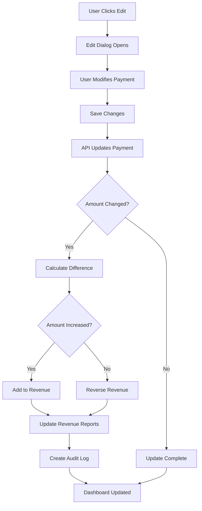
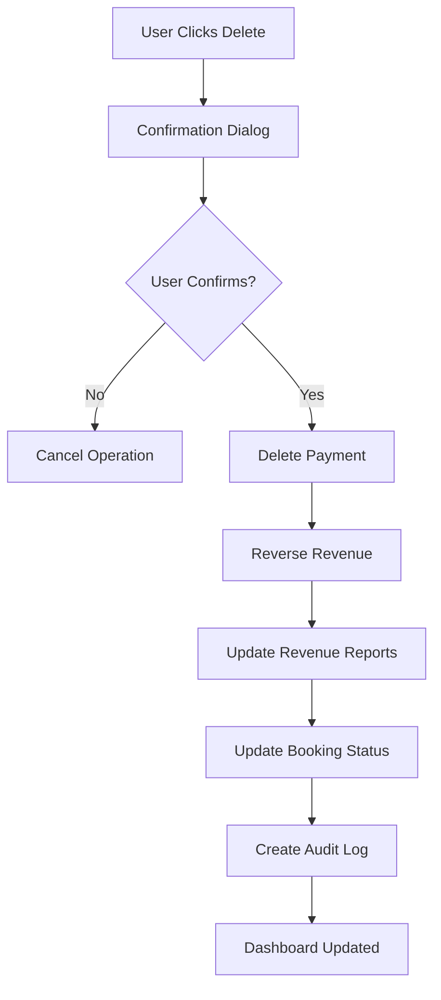

# 🛠️ Revenue Editing & Deletion System

## 📋 Overview

The HMS (Hotel Management System) now includes comprehensive **Revenue Editing & Deletion capabilities** that allow administrators to modify or remove payment records while maintaining automatic revenue tracking and audit trails.

## ✨ Key Features

### 🔧 **Payment Editing**
- **Amount Modification**: Change payment amounts with automatic revenue adjustment
- **Payment Method Updates**: Update payment method information
- **Notes & Reasons**: Add detailed notes for audit trail
- **Automatic Revenue Updates**: Revenue is automatically adjusted when amounts change

### 🗑️ **Payment Deletion**
- **Safe Deletion**: Delete payments with comprehensive confirmation
- **Revenue Reversal**: Automatically reverse revenue when payments are deleted
- **Audit Trail**: Complete audit trail for all deletions
- **Status Updates**: Update booking payment status after deletion

### 📊 **Revenue Management Dashboard**
- **Edit/Delete Actions**: Direct access to edit and delete payments
- **Real-time Updates**: See changes immediately in the dashboard
- **Status Indicators**: Visual indicators for revenue tracking status
- **Payment History**: Complete payment history with actions

## 🏗️ System Architecture

### **Core Components**

1. **Revenue Tracking Dashboard** (`components/dashboard/revenue-tracking-dashboard.tsx`)
   - Edit and delete payment buttons
   - Confirmation dialogs
   - Real-time status updates

2. **Payment Management API** (`app/api/payments/[id]/route.ts`)
   - PUT endpoint for payment updates
   - DELETE endpoint for payment deletion
   - Automatic revenue adjustment

3. **Revenue Hooks** (`lib/revenue-hooks.ts`)
   - Revenue reversal functionality
   - Audit logging
   - Status updates

## 🔄 **Workflow**

### **Payment Editing Process**


### **Payment Deletion Process**


## 🛠️ **Technical Implementation**

### **API Endpoints**

```typescript
// Update Payment
PUT /api/payments/[id]
{
  "amount": 5000,
  "paymentMethod": "card",
  "notes": "Payment adjustment",
  "reason": "Revenue adjustment"
}

// Delete Payment
DELETE /api/payments/[id]
{
  "reason": "Revenue reversal",
  "processedBy": "Admin"
}
```

### **Revenue Adjustment Logic**

```typescript
// Calculate amount difference
const amountDifference = newAmount - originalAmount;

if (amountDifference > 0) {
  // Amount increased - add to revenue
  await RevenueHooks.onPaymentCompleted(bookingId, amountDifference);
} else if (amountDifference < 0) {
  // Amount decreased - reverse revenue
  await RevenueHooks.onPaymentReversed(bookingId, Math.abs(amountDifference));
}
```

### **Audit Trail**

```typescript
// Create audit log for modifications
await prisma.transaction.create({
  data: {
    type: amountDifference > 0 ? 'credit' : 'debit',
    category: 'payment_modification',
    amount: Math.abs(amountDifference),
    description: `Payment modification: ${reason}`,
    isModification: true,
    originalAmount: originalAmount,
    modificationReason: reason,
  },
});
```

## 🎯 **Usage Guide**

### **For Administrators**

#### **Editing Payments**
1. **Navigate to Revenue Tracking**: Go to `/dashboard/revenue-tracking`
2. **Find Payment**: Locate the payment in the recent payments list
3. **Click Edit**: Click the edit icon (✏️) next to the payment
4. **Modify Details**: Update amount, payment method, or notes
5. **Save Changes**: Click "Save Changes" to apply modifications
6. **Verify Updates**: Check that revenue is automatically adjusted

#### **Deleting Payments**
1. **Navigate to Revenue Tracking**: Go to `/dashboard/revenue-tracking`
2. **Find Payment**: Locate the payment in the recent payments list
3. **Click Delete**: Click the delete icon (🗑️) next to the payment
4. **Review Warning**: Read the confirmation dialog carefully
5. **Confirm Deletion**: Click "Delete Payment" to proceed
6. **Verify Reversal**: Check that revenue is automatically reversed

### **For Staff**
- **View Only**: Staff can view payment history but cannot edit/delete
- **Report Issues**: Contact administrators for payment corrections
- **Monitor Changes**: See real-time updates in the dashboard

## 🔍 **Features**

### **Edit Payment Dialog**
- **Amount Field**: Numeric input for payment amount
- **Payment Method**: Text input for payment method
- **Notes Field**: Text area for adjustment reasons
- **Save/Cancel**: Clear action buttons

### **Delete Payment Dialog**
- **Warning Message**: Clear warning about deletion consequences
- **Payment Details**: Shows payment information before deletion
- **Confirmation**: Requires explicit confirmation
- **Audit Information**: Explains what will be recorded

### **Real-time Updates**
- **Immediate Feedback**: Changes appear instantly
- **Status Updates**: Payment status updates automatically
- **Revenue Adjustment**: Revenue reports update immediately
- **Audit Logs**: All changes are logged for compliance

## 📈 **Benefits**

### **For Hotel Management**
- **Flexible Revenue Management**: Adjust payments as needed
- **Error Correction**: Fix payment mistakes easily
- **Audit Compliance**: Complete audit trail for all changes
- **Real-time Accuracy**: Always have accurate revenue data

### **For Financial Reporting**
- **Accurate Records**: Maintain accurate financial records
- **Audit Trail**: Complete history of all modifications
- **Compliance**: Meet financial reporting requirements
- **Transparency**: Clear visibility into all changes

### **For Operations**
- **Error Recovery**: Quickly fix payment errors
- **Customer Service**: Handle payment disputes efficiently
- **Data Integrity**: Maintain data accuracy
- **Process Efficiency**: Streamlined payment management

## 🔒 **Security & Compliance**

### **Access Control**
- **Admin Only**: Only administrators can edit/delete payments
- **Session Validation**: All operations require valid session
- **Audit Logging**: All changes are logged with user information

### **Data Integrity**
- **Transaction Safety**: All operations use database transactions
- **Revenue Consistency**: Revenue is always consistent with payments
- **Status Synchronization**: Payment status stays synchronized

### **Audit Trail**
- **Complete History**: All modifications are recorded
- **User Tracking**: Track who made each change
- **Reason Documentation**: All changes include reasons
- **Timestamp Recording**: All changes are timestamped

## 🚨 **Important Considerations**

### **Before Editing/Deleting**
- **Verify Payment**: Double-check payment details before modifying
- **Document Reason**: Always provide a clear reason for changes
- **Consider Impact**: Understand the impact on revenue reports
- **Backup Data**: Ensure you have backup data if needed

### **After Changes**
- **Verify Updates**: Check that revenue reports are updated correctly
- **Review Audit Logs**: Review audit logs for accuracy
- **Update Documentation**: Update any relevant documentation
- **Notify Stakeholders**: Inform relevant stakeholders of changes

## 🔧 **Configuration**

### **Environment Variables**
```env
# Enable/disable payment editing
ENABLE_PAYMENT_EDITING=true

# Enable/disable payment deletion
ENABLE_PAYMENT_DELETION=true

# Audit log level
AUDIT_LOG_LEVEL=info
```

### **Permissions**
```typescript
// Check user permissions
const canEditPayments = user.role === 'admin';
const canDeletePayments = user.role === 'admin';
```

## 🚀 **Future Enhancements**

### **Planned Features**
- **Bulk Operations**: Edit/delete multiple payments at once
- **Advanced Filters**: Filter payments by date, amount, method
- **Export Functionality**: Export payment history and audit logs
- **Notification System**: Notify relevant parties of changes
- **Approval Workflow**: Require approval for large changes

### **Performance Optimizations**
- **Caching**: Cache frequently accessed payment data
- **Batch Processing**: Process multiple changes efficiently
- **Background Jobs**: Handle large operations asynchronously
- **Database Optimization**: Optimize queries for better performance

## 📞 **Support**

For technical support or questions about revenue editing and deletion:

1. **Check Audit Logs**: Review audit logs for detailed information
2. **Review Documentation**: Refer to this README and system documentation
3. **Contact Development Team**: For complex issues or feature requests

---

**Note**: The revenue editing and deletion system provides flexible payment management while maintaining data integrity and audit compliance. Always use these features responsibly and document all changes appropriately.
