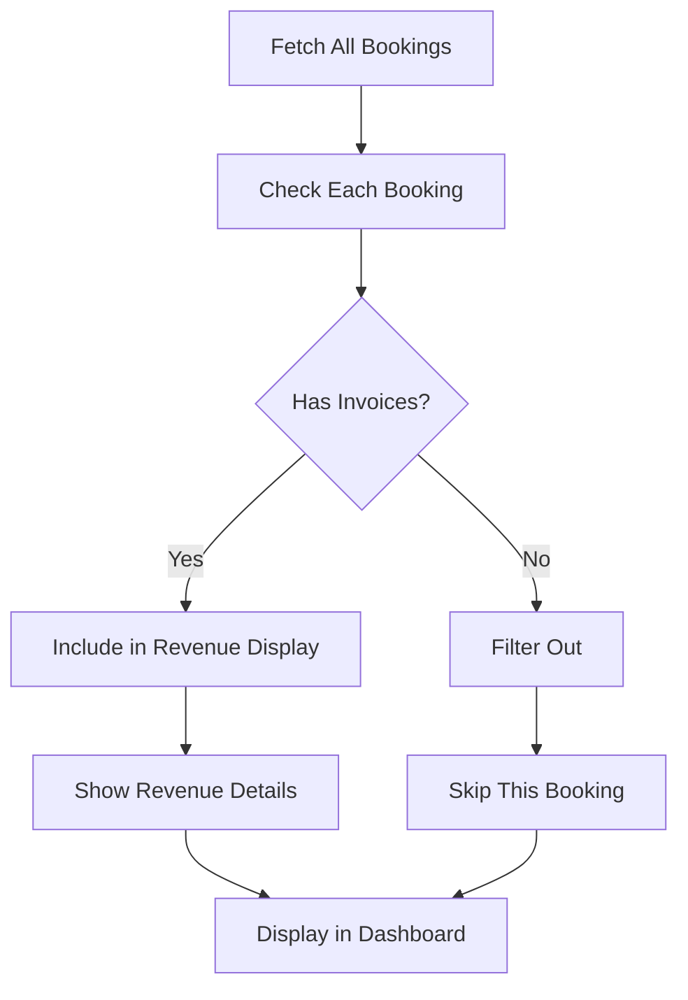
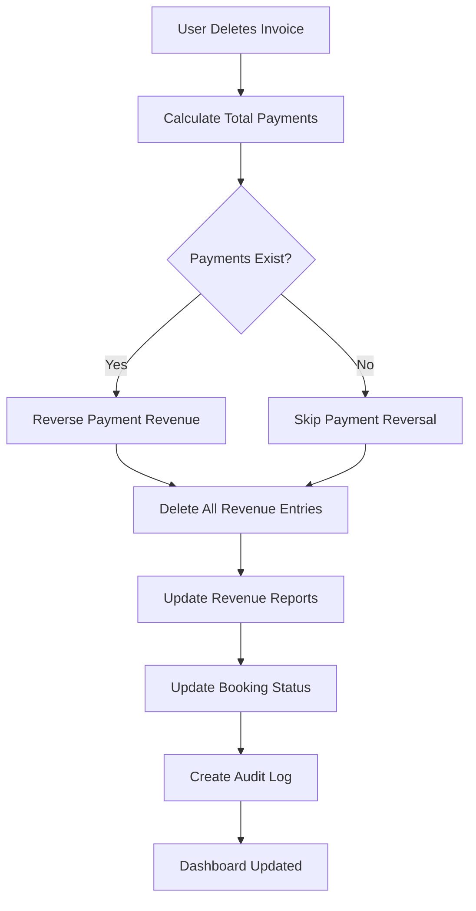

# 🎯 Revenue Filtering & Automatic Deletion System

## 📋 Overview

The HMS (Hotel Management System) now includes **smart revenue filtering** and **automatic revenue deletion** capabilities that ensure:

1. **Only bookings with invoices** are shown in revenue tracking
2. **Revenue entries are automatically deleted** when invoices are deleted
3. **Clean revenue data** with no orphaned entries

## ✨ Key Features

### 🔍 **Smart Revenue Filtering**
- **Invoice-Based Display**: Only shows revenue for bookings that have invoices/bills generated
- **Clean Interface**: Hides bookings without invoices to avoid confusion
- **Clear Messaging**: Shows helpful message when no invoices exist

### 🗑️ **Automatic Revenue Deletion**
- **Invoice Deletion**: When invoices are deleted, all related revenue entries are automatically removed
- **Complete Cleanup**: Removes revenue from daily, monthly, and yearly reports
- **Audit Trail**: Maintains complete audit trail for all deletions

### 📊 **Enhanced Revenue Tracking**
- **Accurate Data**: Only tracks revenue for actual billable items
- **Real-time Updates**: Revenue disappears immediately when invoices are deleted
- **Category-wise Deletion**: Properly removes revenue from all service categories

## 🏗️ System Architecture

### **Core Components**

1. **Enhanced Revenue Status API** (`app/api/revenue/status/route.ts`)
   - Checks if booking has invoices
   - Returns `hasInvoices` flag
   - Filters out bookings without bills

2. **Revenue Tracking Dashboard** (`components/dashboard/revenue-tracking-dashboard.tsx`)
   - Only displays bookings with invoices
   - Shows helpful message for empty state
   - Real-time filtering

3. **Revenue Hooks** (`lib/revenue-hooks.ts`)
   - `deleteRevenueForBooking()` method
   - Complete revenue cleanup
   - Multi-period deletion

4. **Invoice Deletion API** (`app/api/invoices/[id]/route.ts`)
   - Calls revenue deletion on invoice removal
   - Automatic cleanup process

## 🔄 **Workflow**

### **Revenue Display Process**


### **Invoice Deletion Process**


## 🛠️ **Technical Implementation**

### **Revenue Status API Enhancement**

```typescript
// Check if booking has any invoices/bills generated
const hasInvoices = booking.invoices.length > 0;

return NextResponse.json({
  bookingId,
  guestName: booking.guestName,
  totalAmount: booking.totalAmount,
  totalPaid,
  remainingAmount,
  paymentStatus: booking.paymentStatus,
  revenueStatus,
  recentPayments: booking.payments.slice(0, 5),
  checkIn: booking.checkIn,
  checkOut: booking.checkOut,
  hasInvoices, // New flag to indicate if invoices exist
});
```

### **Revenue Dashboard Filtering**

```typescript
// Only include bookings that have invoices/bills generated
const revenueData = await revenueResponse.json();
return revenueData.hasInvoices ? revenueData : null;
```

### **Revenue Deletion Method**

```typescript
static async deleteRevenueForBooking(bookingId: string) {
  // Get booking with bill items
  const booking = await prisma.booking.findUnique({
    where: { id: bookingId },
    include: {
      billItems: {
        include: { service: true },
      },
    },
  });

  // Calculate total amount to delete from each category
  const totalAmount = booking.billItems.reduce((sum, item) => sum + item.amount, 0);
  const categoryAmounts = this.calculateCategoryAmounts(booking, totalAmount);

  // Delete from all revenue reports
  await this.deleteFromRevenueReport(booking.checkIn, 'daily', categoryAmounts);
  await this.deleteFromRevenueReport(booking.checkIn, 'monthly', categoryAmounts);
  await this.deleteFromRevenueReport(booking.checkIn, 'yearly', categoryAmounts);
}
```

### **Invoice Deletion Integration**

```typescript
// Delete all revenue entries for this booking since invoices are being deleted
console.log(`🗑️ Deleting all revenue entries for booking ${booking.id}`);
await RevenueHooks.deleteRevenueForBooking(booking.id);
```

## 🎯 **Usage Guide**

### **For Administrators**

#### **Viewing Revenue**
1. **Navigate to Revenue Tracking**: Go to `/dashboard/revenue-tracking`
2. **See Filtered Results**: Only bookings with invoices are displayed
3. **Generate Invoices**: Go to Billing Management to create invoices
4. **View Revenue**: Return to Revenue Tracking to see updated data

#### **Deleting Invoices**
1. **Navigate to Billing Management**: Go to `/dashboard/billing`
2. **Find Invoice**: Locate the invoice to delete
3. **Click Delete**: Click the delete icon (🗑️)
4. **Confirm Deletion**: Review and confirm the deletion
5. **Automatic Cleanup**: Revenue entries are automatically deleted

### **For Staff**
- **Clear Understanding**: Only see revenue for actual billable items
- **No Confusion**: No orphaned revenue entries
- **Accurate Reports**: Revenue reports reflect actual business

## 🔍 **Features**

### **Smart Filtering**
- **Invoice Check**: Automatically checks if bookings have invoices
- **Conditional Display**: Only shows relevant revenue data
- **Helpful Messages**: Clear guidance when no invoices exist

### **Automatic Cleanup**
- **Complete Deletion**: Removes all revenue entries when invoices are deleted
- **Multi-period Updates**: Updates daily, monthly, and yearly reports
- **Category Accuracy**: Properly handles different service categories

### **Real-time Updates**
- **Immediate Removal**: Revenue disappears instantly when invoices are deleted
- **Dashboard Refresh**: Automatic updates in revenue tracking
- **Status Synchronization**: Booking status updates automatically

## 📈 **Benefits**

### **For Hotel Management**
- **Accurate Revenue Data**: Only tracks actual billable revenue
- **Clean Reports**: No orphaned or incorrect revenue entries
- **Better Decision Making**: Reliable financial data for planning

### **For Financial Reporting**
- **Data Integrity**: Revenue always matches actual invoices
- **Audit Compliance**: Complete audit trail for all changes
- **Accurate Analytics**: Reliable data for business analysis

### **For Operations**
- **Reduced Confusion**: Clear distinction between billable and non-billable items
- **Efficient Workflow**: Streamlined invoice and revenue management
- **Error Prevention**: Automatic cleanup prevents data inconsistencies

## 🔒 **Security & Compliance**

### **Data Integrity**
- **Automatic Cleanup**: No orphaned revenue entries
- **Consistent State**: Revenue always matches invoice status
- **Audit Trail**: Complete history of all deletions

### **Access Control**
- **Admin Only**: Only administrators can delete invoices
- **Session Validation**: All operations require valid session
- **Audit Logging**: All changes are logged with user information

## 🚨 **Important Considerations**

### **Before Deleting Invoices**
- **Verify Impact**: Understand that revenue will be completely removed
- **Document Reason**: Always provide a clear reason for deletion
- **Consider Alternatives**: Consider editing instead of deleting if possible

### **After Deletion**
- **Verify Cleanup**: Check that revenue has been properly removed
- **Review Reports**: Ensure revenue reports are accurate
- **Update Documentation**: Update any relevant documentation

## 🔧 **Configuration**

### **Environment Variables**
```env
# Enable/disable revenue filtering
ENABLE_REVENUE_FILTERING=true

# Enable/disable automatic revenue deletion
ENABLE_AUTOMATIC_REVENUE_DELETION=true

# Audit log level
AUDIT_LOG_LEVEL=info
```

### **Database Schema**
```sql
-- Revenue reports table with category fields
CREATE TABLE revenue_report (
  id VARCHAR(191) PRIMARY KEY,
  date DATETIME(3) NOT NULL,
  period_type ENUM('daily', 'monthly', 'yearly') NOT NULL,
  accommodation_revenue DECIMAL(10,2) DEFAULT 0,
  food_beverage_revenue DECIMAL(10,2) DEFAULT 0,
  spa_revenue DECIMAL(10,2) DEFAULT 0,
  -- ... other category fields
);
```

## 🚀 **Future Enhancements**

### **Planned Features**
- **Bulk Invoice Operations**: Delete multiple invoices at once
- **Revenue Recovery**: Ability to recover deleted revenue if needed
- **Advanced Filtering**: Filter by date ranges, amounts, categories
- **Export Functionality**: Export filtered revenue data

### **Performance Optimizations**
- **Caching**: Cache invoice status for faster filtering
- **Batch Processing**: Process multiple deletions efficiently
- **Background Jobs**: Handle large operations asynchronously

## 📞 **Support**

For technical support or questions about revenue filtering and deletion:

1. **Check Audit Logs**: Review audit logs for detailed information
2. **Review Documentation**: Refer to this README and system documentation
3. **Contact Development Team**: For complex issues or feature requests

---

**Note**: The revenue filtering and automatic deletion system ensures clean, accurate revenue data by only tracking actual billable items and automatically cleaning up when invoices are removed. This provides reliable financial reporting and better business insights.
