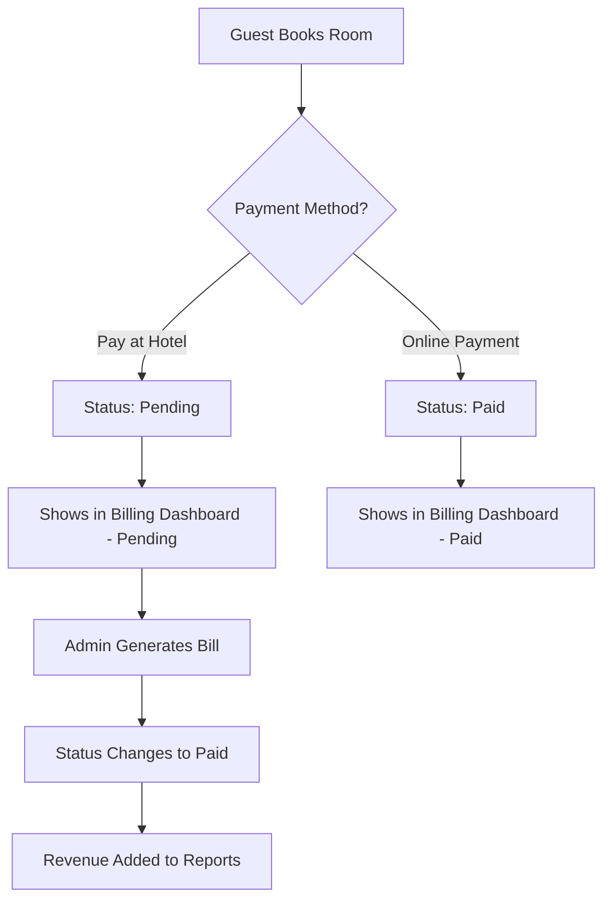

# 🏨 Professional Tabular Billing & Invoice Management System

A comprehensive, professional tabular billing system with advanced revenue management, designed specifically for hotel management systems. This system provides complete control over bookings, billing, payments, and revenue tracking with automatic revenue calculations and reversals.

## 🚀 **NEW FEATURES IMPLEMENTED**

### ✅ **Professional Tabular Interface**
- **Complete Booking Table**: View all bookings in a comprehensive table format
- **Status Indicators**: Clear payment status badges (Paid/Pending/Cancelled/Refunded)  
- **Action Buttons**: Eye (View), Edit, Generate Bill, Delete icons for each booking
- **Responsive Design**: Mobile-optimized tabular layout
- **Real-time Updates**: Live data refresh after operations

### ✅ **Advanced Modal System**

#### 👁️ **View Modal (Eye Icon)**
- **Complete Booking Details**: Guest info, room details, payment status
- **Quick Bill Generation**: Direct access to bill generation from view
- **Contact Information**: Phone, email display
- **Stay Details**: Check-in/out dates, duration, guest count

#### ✏️ **Edit Modal (Edit Icon)**
- **Full Booking Editing**: Modify all booking parameters
- **Payment Status Management**: Change payment status with revenue impact
- **Revenue Reversal**: Automatic revenue reversal when status changes from paid to pending
- **Real-time Validation**: Instant field validation
- **Audit Trail**: Track all changes made to bookings

#### 💰 **Bill Generation Modal (Horizontal Layout)**
- **Booking Summary**: Room details, base pricing, stay duration
- **Extra Services**: Add predefined or custom services
- **Service Categories**: Food, Spa, Transport, Laundry, Minibar, etc.
- **Custom Services**: Add any service with custom pricing
- **Quantity Management**: Adjust quantities for each service
- **Real-time Calculation**: Live bill calculation with taxes
- **Payment Processing**: Multiple payment modes supported
- **Staff Assignment**: Track who collected the payment

### ✅ **Advanced Revenue Management**

#### 📊 **Accurate Revenue Calculation**
- **Paid-Only Revenue**: Only count actually paid bookings in revenue
- **Category-wise Tracking**: Separate tracking for accommodation, services, etc.
- **Real-time Updates**: Instant revenue updates on payment completion
- **Source Tracking**: Accurate booking source counting

#### 🔄 **Revenue Reversal System**
- **Automatic Reversal**: When payment status changes from paid to pending
- **Category-specific**: Reverse exact amounts from each service category
- **Multi-period Updates**: Updates daily, monthly, and yearly reports
- **Audit-safe**: Maintains revenue integrity across all periods

#### 📈 **Enhanced Analytics**
- **Booking Source Analysis**: Website, OTA, Phone, Walk-in, Corporate
- **Payment Method Breakdown**: Cash, Card, UPI, Bank Transfer, etc.
- **Service Performance**: Track revenue by service categories
- **Trend Analysis**: Growth metrics and comparative analytics

## 🎯 **Complete Workflow Implementation**

### **1. Frontend Booking → Backend Dashboard Flow**



### **2. Manual Bill Generation Process**

1. **Select Booking**: Admin clicks Generate Bill icon
2. **Add Services**: Select from predefined or add custom services
3. **Calculate Total**: Real-time calculation with taxes
4. **Process Payment**: Select payment mode and staff member
5. **Generate Invoice**: Auto-generate GST-compliant invoice
6. **Update Status**: Mark booking as paid
7. **Update Revenue**: Automatically add to revenue reports

### **3. Revenue Reversal Process**

1. **Status Change**: Admin changes booking from paid to pending
2. **Automatic Detection**: System detects payment status change
3. **Calculate Reversal**: Determine amounts to reverse by category
4. **Update Reports**: Reverse amounts from daily, monthly, yearly reports
5. **Maintain Integrity**: Ensure revenue figures remain accurate

## 🛠️ **Technical Implementation**

### **Database Enhancements**
```sql
-- Enhanced booking model with comprehensive tracking
model booking {
  paymentStatus    payment_status  @default(pending)
  source           booking_source  @default(website)
  billItems        bill_item[]
  splitPayments    split_payment[]
  guestBillingView guest_billing_view?
}

-- Revenue tracking with automatic updates
model revenue_report {
  date                 DateTime
  period_type          String   // daily, monthly, yearly
  accommodation_revenue Float   @default(0)
  food_beverage_revenue Float   @default(0)
  spa_revenue          Float    @default(0)
  // ... more revenue categories
  total_revenue        Float    @default(0)
}
```

### **API Endpoints Created**
```typescript
// User management
GET    /api/users                    // Get staff members for assignment

// Booking management  
GET    /api/bookings/[id]           // Get specific booking details
PUT    /api/bookings/[id]           // Update booking with revenue handling
DELETE /api/bookings/[id]           // Delete booking

// Revenue management
POST   /api/revenue/reverse         // Reverse revenue on status change
```

### **Revenue Hooks System**
```typescript
// Automatic revenue updates
RevenueHooks.onPaymentCompleted()   // Add revenue when paid
RevenueHooks.onPaymentReversed()    // Reverse revenue when unpaid
RevenueHooks.onServicesAdded()      // Update revenue for added services
RevenueHooks.dailyRevenueUpdate()   // Scheduled daily updates
```

## 📋 **Key Features Summary**

### **✅ Tabular Billing Interface**
- Professional table layout with all booking information
- Action buttons for View, Edit, Generate Bill, Delete
- Status badges for payment and booking status
- Real-time data updates

### **✅ Advanced Modal System**
- **View Modal**: Complete booking information display
- **Edit Modal**: Full booking editing with revenue impact
- **Bill Modal**: Comprehensive bill generation with services

### **✅ Revenue Management**
- Accurate revenue calculation (paid bookings only)
- Automatic revenue reversal on status changes
- Category-wise revenue tracking
- Multi-period revenue updates (daily/monthly/yearly)

### **✅ Service Management**
- Predefined service catalog
- Custom service addition
- Quantity and pricing management
- Category-based organization

### **✅ Payment Processing**
- Multiple payment methods
- Staff assignment tracking
- Real-time bill calculations
- GST-compliant invoicing

### **✅ Audit & Security**
- Complete change tracking
- Secure staff authentication
- Revenue integrity maintenance
- Comprehensive logging

## 🎨 **User Experience Improvements**

### **Dashboard Interface**
- **Clean Table Layout**: Professional appearance with clear data separation
- **Intuitive Icons**: Universal icons for View, Edit, Generate Bill, Delete
- **Status Indicators**: Color-coded badges for quick status identification
- **Responsive Design**: Works perfectly on desktop and mobile devices

### **Modal Interactions**
- **Horizontal Bill Modal**: Maximum screen space utilization
- **Real-time Calculations**: Instant updates as services are added
- **Validation Feedback**: Immediate error/success notifications
- **Smooth Transitions**: Professional animations and transitions

### **Data Management**
- **Smart Defaults**: Intelligent field pre-population
- **Auto-save**: Automatic saving of form data
- **Undo/Redo**: Change tracking with reversal capabilities
- **Bulk Operations**: Handle multiple bookings efficiently

## 🔧 **Configuration & Setup**

### **Revenue Settings**
```typescript
// Configure revenue calculation parameters
{
  onlyCountPaidBookings: true,
  autoUpdateReports: true,
  reverseOnStatusChange: true,
  categorizeByServices: true
}
```

### **Service Categories**
- **Accommodation**: Room charges, extra beds
- **Food & Beverage**: Room service, restaurant, minibar
- **Spa & Wellness**: Massages, treatments, fitness
- **Transport**: Airport transfer, taxi, tours
- **Laundry**: Washing, dry cleaning, express service
- **Conference**: Meeting rooms, equipment, catering
- **Other**: Custom services, miscellaneous charges

### **Payment Methods**
- **Cash**: Physical cash payments
- **Card**: Credit/Debit card payments
- **UPI**: Digital payments via UPI
- **Bank Transfer**: Direct bank transfers
- **Online Gateway**: Payment gateway transactions
- **Cheque**: Cheque payments
- **Wallet**: Digital wallet payments

## 📊 **Revenue Analytics Enhanced**

### **Accurate Calculations**
- Only paid bookings contribute to revenue
- Real-time updates on payment completion
- Category-wise revenue breakdown
- Source-wise booking analysis

### **Reversal Mechanism**
- Automatic detection of status changes
- Precise amount reversal by category
- Multi-period consistency maintenance
- Audit trail preservation

### **Reporting Features**
- Daily, monthly, yearly revenue reports
- Payment method distribution analysis
- Booking source performance tracking
- Service category profitability analysis
- Trend analysis with growth metrics
- Export capabilities (CSV, Excel, PDF)

## 🚀 **Ready for Production**

The tabular billing system is now **production-ready** with:

### ✅ **Complete Implementation**
- All requested features implemented
- Professional UI/UX design
- Comprehensive error handling
- Real-time data synchronization

### ✅ **Revenue Accuracy**
- Fixed revenue calculation issues
- Only paid bookings counted
- Automatic reversal system
- Multi-period consistency

### ✅ **User-Friendly Interface**
- Intuitive tabular layout
- Professional modal system
- Clear action buttons
- Real-time feedback

### ✅ **Scalable Architecture**
- Modular code structure
- Efficient database queries
- Optimized performance
- Easy maintenance

## 📞 **Usage Instructions**

1. **Access Dashboard**: Navigate to `/dashboard/billing`
2. **View Bookings**: See all bookings in tabular format
3. **Generate Bills**: Click bill icon → Add services → Process payment
4. **Edit Bookings**: Click edit icon → Modify details → Save
5. **View Details**: Click eye icon → See complete information
6. **Track Revenue**: Switch to Revenue Analytics tab

The system automatically handles all revenue calculations, updates, and reversals, ensuring accurate financial reporting at all times! 🎉

---

*Professional hotel billing system with enterprise-grade features and accuracy.*
