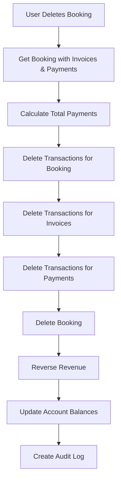
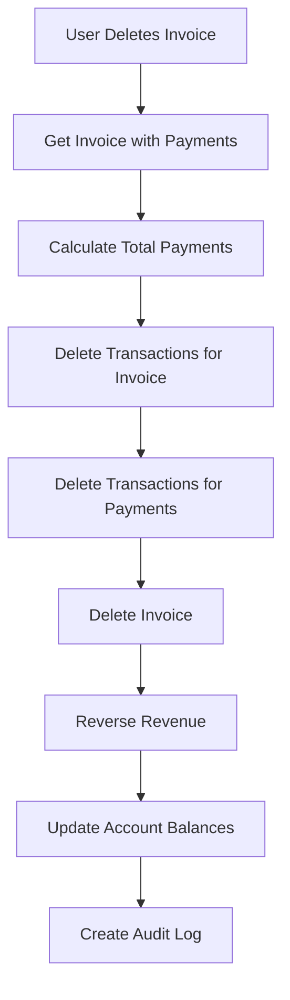
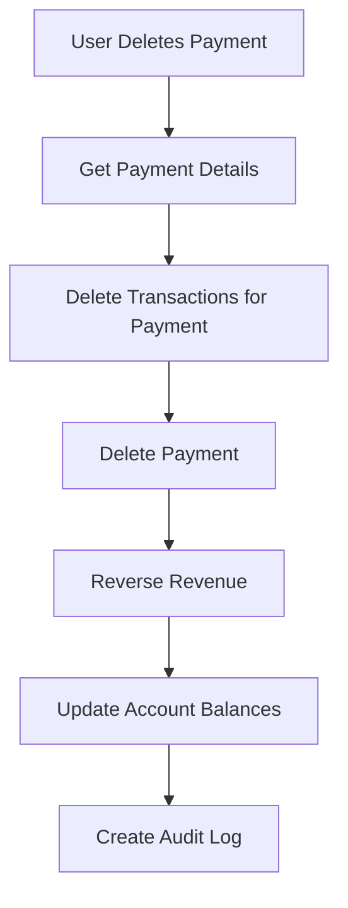

# 🧹 Transaction Cleanup System

## 📋 Overview

The HMS (Hotel Management System) now includes a comprehensive **Transaction Cleanup System** that ensures when bookings, invoices, or payments are deleted, all related transactions in the account management system are automatically deleted as well. This maintains data integrity and prevents orphaned transaction records.

## 🎯 **Problem Solved**

### **Previous Issue**
- When bookings, bills, or invoices were deleted, the corresponding transactions in the account management system remained
- This caused discrepancies between the actual financial data and what was displayed in the account management
- Users would see credited amounts even after the source booking/invoice was deleted

### **Solution Implemented**
- **Automatic Transaction Cleanup**: All related transactions are deleted when their source records are deleted
- **Complete Data Integrity**: No orphaned transactions remain in the system
- **Real-time Balance Updates**: Account balances are immediately corrected

## 🏗️ **System Architecture**

### **Core Components**

1. **Enhanced Booking Deletion API** (`app/api/bookings/[id]/route.ts`)
   - Deletes all transactions related to the booking
   - Deletes all transactions related to the booking's invoices
   - Deletes all transactions related to the booking's payments
   - Reverses revenue and updates account balances

2. **Enhanced Invoice Deletion API** (`app/api/invoices/[id]/route.ts`)
   - Deletes all transactions related to the invoice
   - Deletes all transactions related to the invoice's payments
   - Reverses revenue and updates account balances

3. **Enhanced Payment Deletion API** (`app/api/payments/[id]/route.ts`)
   - Deletes all transactions related to the payment
   - Reverses revenue and updates account balances

## 🔄 **Workflow**

### **Booking Deletion Process**


### **Invoice Deletion Process**


### **Payment Deletion Process**


## 🛠️ **Technical Implementation**

### **Transaction Types Handled**

The system handles three types of transaction references:

1. **Booking Transactions** (`referenceType: 'booking'`)
   - Created when revenue is added to accounts for a booking
   - Deleted when the booking is deleted

2. **Invoice Transactions** (`referenceType: 'invoice'`)
   - Created when invoices are generated
   - Deleted when the invoice is deleted

3. **Payment Transactions** (`referenceType: 'payment'`)
   - Created when payments are processed
   - Deleted when the payment is deleted

### **Database Schema**

```sql
model transaction {
  id                String             @id @default(cuid())
  accountId         String
  type              transaction_type
  category          transaction_category
  amount            Float
  description       String
  referenceId       String?            // Reference to booking/invoice/payment ID
  referenceType     reference_type?    // booking, invoice, payment, etc.
  paymentMethod     payment_method?
  processedBy       String?
  notes             String?            @db.Text
  transactionDate   DateTime           @default(now())
  createdAt         DateTime           @default(now())
  updatedAt         DateTime           @updatedAt
  isModification    Boolean            @default(false)
  originalAmount    Float?
  modificationReason String?           @db.Text
  account           bank_account       @relation(fields: [accountId], references: [id], onDelete: Cascade)
}
```

### **API Endpoints Updated**

#### **Booking Deletion**
```typescript
DELETE /api/bookings/[id]
```

**What it does:**
- Deletes all transactions with `referenceId = booking.id` and `referenceType = 'booking'`
- Deletes all transactions with `referenceId = invoice.id` and `referenceType = 'invoice'` for all invoices of the booking
- Deletes all transactions with `referenceId = payment.id` and `referenceType = 'payment'` for all payments of the booking
- Reverses revenue using `RevenueHooks.onPaymentReversed()`
- Updates account balances

#### **Invoice Deletion**
```typescript
DELETE /api/invoices/[id]
```

**What it does:**
- Deletes all transactions with `referenceId = invoice.id` and `referenceType = 'invoice'`
- Deletes all transactions with `referenceId = payment.id` and `referenceType = 'payment'` for all payments of the invoice
- Reverses revenue using `RevenueHooks.onPaymentReversed()`
- Updates account balances

#### **Payment Deletion**
```typescript
DELETE /api/payments/[id]
```

**What it does:**
- Deletes all transactions with `referenceId = payment.id` and `referenceType = 'payment'`
- Reverses revenue using `RevenueHooks.onPaymentReversed()`
- Updates account balances

## 📊 **Benefits**

### **For Hotel Management**
- **Accurate Financial Data**: Account balances always reflect the current state
- **No Orphaned Records**: Clean transaction history without discrepancies
- **Audit Compliance**: Complete audit trail for all deletions
- **Real-time Updates**: Immediate balance corrections

### **For Staff**
- **Clear Understanding**: Account management shows accurate data
- **No Confusion**: No orphaned transactions to cause confusion
- **Reliable Reports**: Financial reports are always accurate

### **For System Integrity**
- **Data Consistency**: All related data is properly cleaned up
- **Performance**: No unnecessary transaction records
- **Maintainability**: Clean database without orphaned records

## 🔍 **Features**

### **Comprehensive Cleanup**
- **Multi-level Deletion**: Handles booking → invoice → payment hierarchy
- **Transaction Types**: Deletes all relevant transaction types
- **Atomic Operations**: Uses database transactions for consistency

### **Audit Trail**
- **Deletion Logs**: All deletions are logged with reasons
- **Balance Tracking**: Account balances are properly updated
- **Revenue Reversal**: Revenue tracking is properly reversed

### **Error Handling**
- **Graceful Failures**: System continues even if some cleanup steps fail
- **Detailed Logging**: Comprehensive logging for debugging
- **Rollback Support**: Database transactions ensure consistency

## 🎯 **Usage Guide**

### **For Administrators**

#### **Deleting Bookings**
1. **Navigate to Bookings**: Go to `/dashboard/bookings`
2. **Find Booking**: Locate the booking to delete
3. **Click Delete**: Click the delete button
4. **Confirm Deletion**: Review and confirm the deletion
5. **Verify Cleanup**: Check account management to see transactions removed

#### **Deleting Invoices**
1. **Navigate to Billing**: Go to `/dashboard/billing`
2. **Find Invoice**: Locate the invoice to delete
3. **Click Delete**: Click the delete button
4. **Confirm Deletion**: Review and confirm the deletion
5. **Verify Cleanup**: Check account management to see transactions removed

#### **Deleting Payments**
1. **Navigate to Payments**: Go to payment management
2. **Find Payment**: Locate the payment to delete
3. **Click Delete**: Click the delete button
4. **Confirm Deletion**: Review and confirm the deletion
5. **Verify Cleanup**: Check account management to see transactions removed

### **For Staff**
- **Automatic Process**: No manual intervention required
- **Real-time Updates**: See changes immediately
- **Accurate Data**: Always see current financial state

## 🔧 **Monitoring & Debugging**

### **Console Logs**
The system provides detailed console logs for monitoring:

```
🗑️ Deleting transactions for booking abc123
✅ Deleted 3 transactions for booking abc123
🗑️ Deleting transactions for invoices: inv1, inv2
✅ Deleted 2 invoice transactions
🗑️ Deleting transactions for payments: pay1, pay2, pay3
✅ Deleted 3 payment transactions
✅ Booking abc123 deleted successfully
💰 Reversing revenue for deleted booking: 5000 for booking abc123
✅ Revenue reversed successfully for deleted booking
```

### **API Responses**
All deletion APIs return detailed information:

```json
{
  "success": true,
  "message": "Booking deleted successfully and room made available",
  "deletedTransactions": "Revenue transactions also deleted"
}
```

## 🚀 **Future Enhancements**

### **Planned Features**
- **Bulk Deletion**: Support for deleting multiple records at once
- **Advanced Filtering**: More sophisticated transaction filtering
- **Recovery Options**: Ability to recover accidentally deleted records
- **Enhanced Reporting**: Better reporting on deletion activities

### **Performance Optimizations**
- **Batch Operations**: Optimize for large-scale deletions
- **Indexing**: Better database indexing for faster queries
- **Caching**: Cache frequently accessed transaction data

## 📝 **Conclusion**

The Transaction Cleanup System ensures that the Hotel Management System maintains complete data integrity by automatically removing all related transactions when their source records are deleted. This provides users with accurate financial data and eliminates confusion caused by orphaned transaction records.

The system is designed to be robust, with comprehensive error handling and detailed logging to ensure reliable operation in all scenarios.


